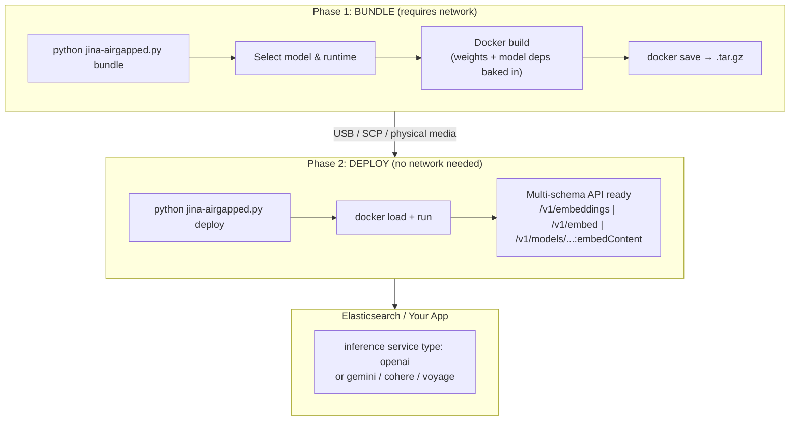

# jina-airgapped

Air-gapped deployment toolkit for Jina AI models. Ship embedding, reranker, and reader models to fully disconnected environments.



## Why

- Customers in regulated/air-gapped environments (gov, finance, healthcare)
- No NVIDIA NIM ($4,500/GPU/yr - overkill for embedding models)
- All models fit on a single L4 GPU (24GB VRAM)
- OpenAI-compatible API - drop-in for Elasticsearch inference service
- Also supports Gemini, Cohere, and Voyage AI schemas out of the box
- Per-model pinned dependency configs baked into each bundle
- Real tok/s throughput measurement built in

## Terminology

This toolkit follows the two-phase terminology used by professional air-gap tools (zarf, NVIDIA NIM, Red Hat disconnected install):

| Phase | Command | Network? | What it does |
|-------|---------|----------|--------------|
| 1 - Bundle | `bundle` | **Required** | Downloads weights, builds Docker image, saves .tar.gz |
| 2 - Deploy | `deploy` | **None** | Loads .tar.gz, starts container - fully offline |

The `serve` command runs a model directly without Docker (model files must be pre-installed).

## Quick Start

### Phase 1: Bundle (connected machine)

```bash
# List all available models
python jina-airgapped.py list

# Interactive wizard: select model, build Docker image, save to .tar.gz
python jina-airgapped.py bundle

# Or specify directly (fastest option for air-gap testing)
python jina-airgapped.py bundle --model jina-embeddings-v5-text-nano --output jina-v5-nano.tar.gz

# CPU-only bundle (no GPU required at deploy time)
python jina-airgapped.py bundle --model jina-embeddings-v5-text-small --cpu-only
```

### Phase 2: Deploy (air-gapped machine, zero network)

```bash
# Transfer the .tar.gz file via USB/SCP/physical media, then:
python jina-airgapped.py deploy --image jina-v5-nano.tar.gz --gpu

# CPU only
python jina-airgapped.py deploy --image jina-v5-nano.tar.gz

# Or raw Docker (same result):
docker load < jina-v5-nano.tar.gz
docker run --gpus all -p 8080:8080 jina/jina-embeddings-v5-text-nano:gpu
```

### Verify it works

```bash
curl http://localhost:8080/health
```

## Available Models

Models licensed under CC-BY-NC-4.0 require a commercial license for commercial use. Contact [Elastic sales](https://www.elastic.co/contact) for a waiver.

| Model | Type | Modality | Params | VRAM | Context | Dim | License |
|-------|------|----------|--------|------|---------|-----|---------|
| jina-embeddings-v5-omni-small | embedding | text/image/audio/video | 1.74B | ~8GB | 32K | 1024 | CC-BY-NC-4.0 |
| jina-embeddings-v5-omni-nano | embedding | text/image/audio/video | 1.04B | ~5GB | 8K | 768 | CC-BY-NC-4.0 |
| jina-embeddings-v5-text-small | embedding | text | 677M | ~3GB | 32K | 1024 | CC-BY-NC-4.0 |
| jina-embeddings-v5-text-nano | embedding | text | 239M | ~2GB | 8K | 768 | CC-BY-NC-4.0 |
| jina-vlm | vlm | text/image | 2.4B | ~6GB | 32K | - | CC-BY-NC-4.0 |
| jina-reranker-v3 | reranker | text | 597M | ~3GB | 131K | - | CC-BY-NC-4.0 |
| jina-code-embeddings-1.5b | embedding | code | 1.5B | ~4GB | 32K | 1536 | CC-BY-NC-4.0 |
| jina-code-embeddings-0.5b | embedding | code | 494M | ~2GB | 32K | 896 | CC-BY-NC-4.0 |
| jina-embeddings-v4 | embedding | text/image/PDF | 3.8B | ~10GB | 32K | 2048 | Qwen Research |
| jina-reranker-m0 | reranker | text/image | 2.4B | ~6GB | 10K | - | CC-BY-NC-4.0 |
| ReaderLM-v2 | reader | text | 1.54B | ~4GB | 512K | - | CC-BY-NC-4.0 |
| jina-clip-v2 | embedding | text/image | 865M | ~4GB | 8K | 1024 | CC-BY-NC-4.0 |
| jina-embeddings-v3 | embedding | text | 570M | ~3GB | 8K | 1024 | CC-BY-NC-4.0 |
| jina-colbert-v2 | colbert | text | 560M | ~3GB | 8K | 128 | CC-BY-NC-4.0 |
| reader-lm-1.5b | reader | text | 1.54B | ~4GB | 256K | - | CC-BY-NC-4.0 |
| reader-lm-0.5b | reader | text | 494M | ~2GB | 256K | - | CC-BY-NC-4.0 |
| jina-reranker-v2-base-multilingual | reranker | text | 278M | ~1GB | 1K | - | CC-BY-NC-4.0 |
| jina-clip-v1 | embedding | text/image | 223M | ~1GB | 8K | 768 | Apache-2.0 |
| jina-reranker-v1-turbo-en | reranker | text | 37.8M | ~1GB | 8K | - | Apache-2.0 |
| jina-reranker-v1-tiny-en | reranker | text | 33M | ~1GB | 8K | - | Apache-2.0 |
| jina-reranker-v1-base-en | reranker | text | 137M | ~1GB | 8K | - | Apache-2.0 |
| jina-colbert-v1-en | colbert | text | 137M | ~1GB | 8K | 128 | Apache-2.0 |
| jina-embeddings-v2-base-es | embedding | text | 161M | ~1GB | 8K | 768 | Apache-2.0 |
| jina-embeddings-v2-base-code | embedding | code | 137M | ~1GB | 8K | 768 | Apache-2.0 |
| jina-embeddings-v2-base-de | embedding | text | 161M | ~1GB | 8K | 768 | Apache-2.0 |
| jina-embeddings-v2-base-zh | embedding | text | 161M | ~1GB | 8K | 768 | Apache-2.0 |
| jina-embeddings-v2-base-en | embedding | text | 137M | ~1GB | 8K | 768 | Apache-2.0 |
| jina-embedding-b-en-v1 | embedding | text | 110M | ~1GB | 512 | 768 | Apache-2.0 |

## API Schemas

The server exposes 4 API schemas simultaneously on different endpoints. No configuration needed - all are active at startup.

### Schema 1: OpenAI (+ Voyage AI)

**Endpoint:** `POST /v1/embeddings`

Drop-in compatible with the OpenAI Python client and Elasticsearch inference service. Voyage AI fields (`input_type`, `output_dimension`) are also accepted.

```bash
# OpenAI style
curl -X POST http://localhost:8080/v1/embeddings \
  -H "Content-Type: application/json" \
  -d '{"input": ["Hello world", "Jina AI"], "model": "jina-embeddings-v5-text-nano"}'

# With task parameter
curl -X POST http://localhost:8080/v1/embeddings \
  -H "Content-Type: application/json" \
  -d '{"input": ["search query"], "task": "retrieval.query"}'

# Matryoshka truncation
curl -X POST http://localhost:8080/v1/embeddings \
  -H "Content-Type: application/json" \
  -d '{"input": ["Hello"], "dimensions": 128}'

# Voyage AI style (input_type maps to Jina task)
curl -X POST http://localhost:8080/v1/embeddings \
  -H "Content-Type: application/json" \
  -d '{"input": ["search query"], "input_type": "query", "output_dimension": 256}'
```

```python
# OpenAI Python client
from openai import OpenAI
client = OpenAI(base_url="http://localhost:8080/v1", api_key="not-needed")
resp = client.embeddings.create(model="jina-embeddings-v5-text-nano", input=["Hello world"])
print(resp.data[0].embedding[:5])

# Voyage AI Python client
import voyageai
vo = voyageai.Client(api_key="not-needed", base_url="http://localhost:8080")
result = vo.embed(["Hello world"], model="jina-v5-nano", input_type="query")
print(result.embeddings[0][:5])
```

Response format:
```json
{
  "object": "list",
  "data": [{"object": "embedding", "embedding": [...], "index": 0}],
  "model": "jinaai/jina-embeddings-v5-text-nano",
  "usage": {"prompt_tokens": 4, "total_tokens": 4, "tok_per_s": 4823.7}
}
```

### Schema 2: Cohere

**Endpoint:** `POST /v1/embed`

```bash
curl -X POST http://localhost:8080/v1/embed \
  -H "Content-Type: application/json" \
  -d '{
    "texts": ["Hello world", "Jina AI"],
    "model": "jina-embeddings-v5-text-nano",
    "input_type": "search_query"
  }'
```

```python
import cohere
co = cohere.Client(api_key="not-needed", base_url="http://localhost:8080")
resp = co.embed(texts=["Hello world"], model="jina-v5-nano", input_type="search_query")
print(resp.embeddings.float[0][:5])
```

Response format:
```json
{
  "id": "abc123",
  "texts": ["Hello world", "Jina AI"],
  "embeddings": {"float": [[...], [...]]},
  "meta": {"api_version": {"version": "1"}, "billed_units": {"input_tokens": 4}, "tok_per_s": 4823.7},
  "response_type": "embeddings_floats"
}
```

Supported `input_type` values: `search_query`, `search_document`, `classification`, `clustering`

### Schema 3: Google Gemini

**Endpoints:**
- `POST /v1/models/{model}:embedContent` - single text
- `POST /v1/models/{model}:batchEmbedContents` - batch

```bash
# Single content
curl -X POST "http://localhost:8080/v1/models/jina-embeddings-v5-text-nano:embedContent" \
  -H "Content-Type: application/json" \
  -d '{
    "content": {"parts": [{"text": "Hello world"}]},
    "taskType": "RETRIEVAL_QUERY",
    "outputDimensionality": 256
  }'

# Batch
curl -X POST "http://localhost:8080/v1/models/jina-embeddings-v5-text-nano:batchEmbedContents" \
  -H "Content-Type: application/json" \
  -d '{
    "requests": [
      {"content": {"parts": [{"text": "Hello"}]}, "taskType": "RETRIEVAL_DOCUMENT"},
      {"content": {"parts": [{"text": "World"}]}, "taskType": "RETRIEVAL_DOCUMENT"}
    ]
  }'
```

```python
import google.generativeai as genai
genai.configure(api_key="not-needed", transport="rest", client_options={"api_endpoint": "http://localhost:8080"})
result = genai.embed_content(
    model="models/jina-embeddings-v5-text-nano",
    content="Hello world",
    task_type="RETRIEVAL_QUERY",
)
print(result["embedding"][:5])
```

Supported `taskType` values: `RETRIEVAL_QUERY`, `RETRIEVAL_DOCUMENT`, `SEMANTIC_SIMILARITY`, `CLASSIFICATION`, `CLUSTERING`

Single content response:
```json
{
  "embedding": {"values": [...]},
  "metadata": {"tokenCount": 4, "tok_per_s": 4823.7}
}
```

## Throughput

Measured on L4 GPU (CUDA) with `jina-embeddings-v5-text-nano`:

| Mode | Batch | Tok/s |
|------|-------|-------|
| GPU (L4) | 100 | ~4,000-6,000 tok/s |
| CPU | 100 | ~300-800 tok/s |

The `/v1/embeddings` response includes `usage.tok_per_s` - actual tokenizer-counted throughput for each request. The `/health` endpoint reports cumulative stats.

## Supported Tasks (v5)

All v5 models support the `task` parameter:

- `retrieval.query` (default)
- `retrieval.passage`
- `text-matching`
- `separation`
- `classification`
- `clustering`

## Per-Model Dependency Configs

Each model in `models/catalog.json` has a `deps` field with pinned version requirements:

```json
{
  "id": "jina-embeddings-v5-text-nano",
  "deps": {
    "transformers": ">=4.45.0,<5.0.0",
    "sentence-transformers": ">=3.0.0",
    "torch": ">=2.1.0",
    "flash-attn": null
  }
}
```

`null` means the dep is optional and will be skipped. The `bundle` command automatically reads these and generates model-specific requirements before building the Docker image - no manual configuration needed.

Models that need flash-attn for long contexts (v5-omni, v4, code embeddings, reranker-v3, readers):
```json
{
  "id": "jina-embeddings-v4",
  "deps": {
    "transformers": ">=4.45.0,<5.0.0",
    "sentence-transformers": ">=3.0.0",
    "torch": ">=2.1.0",
    "flash-attn": ">=2.5.0",
    "timm": ">=1.0.0",
    "Pillow": ">=10.0.0"
  }
}
```

## Elasticsearch Integration

```json
PUT _inference/text_embedding/jina-local
{
  "service": "openai",
  "service_settings": {
    "url": "http://your-host:8080/v1/embeddings",
    "model_id": "jina-embeddings-v5-text-nano",
    "api_key": "not-needed"
  }
}
```

## Serve Without Docker

If model dependencies are already installed:

```bash
python jina-airgapped.py serve --model jinaai/jina-embeddings-v5-text-nano --port 8080

# From local path
python jina-airgapped.py serve --local-path /data/models/jina-v5-nano
```

## Design

- **Two-phase terminology**: `bundle` (Phase 1, needs network) and `deploy` (Phase 2, offline) - aligned with zarf, NVIDIA NIM, Red Hat disconnected install patterns
- **Zero deps for TUI**: `jina-airgapped.py` uses Python stdlib only
- **Model weights baked in**: `HF_HUB_OFFLINE=1` enforced at runtime, zero downloads
- **Per-model deps**: `catalog.json` `deps` field drives model-specific requirements; Dockerfile installs them at bundle time
- **Multi-schema API**: OpenAI, Voyage AI, Cohere, Gemini - all active simultaneously on different endpoints
- **Multi-stage Docker build**: small runtime image, weights in separate layer
- **GPU auto-detect**: falls back to CPU if no GPU
- **Matryoshka support**: pass `dimensions` to truncate embeddings
- **Real tok/s**: actual tokenizer-counted throughput, not word-split estimates

## Repo Structure

```
jina-airgapped/
├── README.md
├── jina-airgapped.py          # Main CLI tool (bundle/deploy/serve/list)
├── models/
│   └── catalog.json           # 28 model registry with deps field
├── docker/
│   └── embeddings/
│       └── Dockerfile         # Reads model-requirements.txt at build time
├── server/
│   ├── app.py                 # FastAPI server: OpenAI, Voyage, Gemini, Cohere endpoints
│   └── requirements.txt       # Base server deps
└── tests/
    └── test_e2e.py            # E2E tests with throughput validation
```
