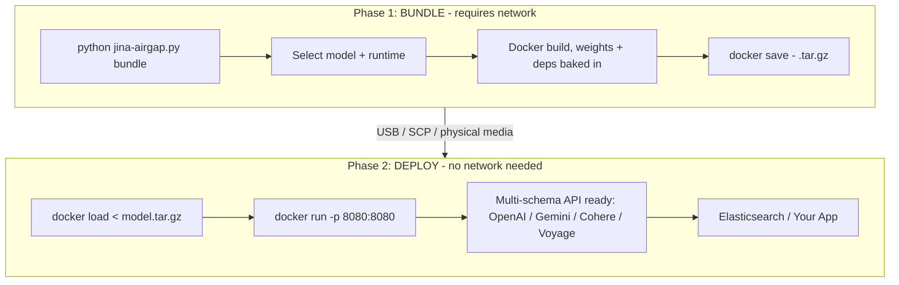

# jina-airgap

Air-gapped deployment toolkit for Jina AI models. Bundle embedding, reranker, and reader models into self-contained Docker images that run fully offline.

> **New here?** The [Quick Start wiki page](https://github.com/jina-ai/jina-airgap/wiki/Quick-Start) gets you to your first `/v1/embeddings` response in 5 minutes using a prebuilt image. Full tutorials, troubleshooting, and the model catalog live in the [wiki](https://github.com/jina-ai/jina-airgap/wiki).




## Quick start

### Already have a prebuilt? Skip bundling

```bash
./scripts/pull-prebuilt.sh jina-embeddings-v5-text-nano cpu
# produces jina-embeddings-v5-text-nano-cpu.tar.gz
# transfer it, then on the offline machine:
docker load < jina-embeddings-v5-text-nano-cpu.tar.gz
docker run -p 8080:8080 jina/jina-embeddings-v5-text-nano:cpu
```

### Bundle from scratch

```bash
python jina-airgap.py list                                       # show all models
python jina-airgap.py bundle                                     # interactive picker
python jina-airgap.py bundle --model jina-embeddings-v5-text-nano --cpu-only --yes
```

Need a builder machine? [`scripts/bootstrap-gcp.sh`](scripts/bootstrap-gcp.sh) provisions one on GCP with Docker + NVIDIA Container Toolkit + the repo pre-cloned.

### Deploy (air-gapped machine)

No repo, no scripts, no Python. Just Docker.

```bash
docker load < MODEL.tar.gz
docker run -p 8080:8080 jina/MODEL:cpu                           # CPU
docker run --gpus all -p 8080:8080 jina/MODEL:gpu                # GPU
curl http://localhost:8080/health
```

Or via docker compose:

```bash
MODEL=jina-embeddings-v5-text-nano RUNTIME=cpu docker compose up -d
# for embed + rerank side-by-side:
docker compose -f docker-compose.multi.yml up -d
```

### Python client

```bash
uv pip install openai requests
python examples/python_client.py
```

Drops in via OpenAI SDK with `base_url="http://your-host:8080/v1"`.

## Models

28 models supported: embeddings (v5, v4, v3, v2), rerankers, readers, ColBERT, CLIP, VLM. All 7 prebuilt images:

| Model | Type | Modality | Params | VRAM | Prebuilt |
|---|---|---|---|---|---|
| `jina-embeddings-v5-text-nano` | embedding | text | 239M | ~2GB | [cpu](https://github.com/orgs/jina-ai/packages/container/jina-airgap%2Fjina-embeddings-v5-text-nano) / [gpu](https://github.com/orgs/jina-ai/packages/container/jina-airgap%2Fjina-embeddings-v5-text-nano) |
| `jina-embeddings-v5-text-small` | embedding | text | 677M | ~3GB | [cpu](https://github.com/orgs/jina-ai/packages/container/jina-airgap%2Fjina-embeddings-v5-text-small) / [gpu](https://github.com/orgs/jina-ai/packages/container/jina-airgap%2Fjina-embeddings-v5-text-small) |
| `jina-embeddings-v3` | embedding | text | 570M | ~3GB | [cpu](https://github.com/orgs/jina-ai/packages/container/jina-airgap%2Fjina-embeddings-v3) / [gpu](https://github.com/orgs/jina-ai/packages/container/jina-airgap%2Fjina-embeddings-v3) |
| `jina-embeddings-v5-omni-nano` | embedding | multimodal | 1.04B | ~5GB | [cpu](https://github.com/orgs/jina-ai/packages/container/jina-airgap%2Fjina-embeddings-v5-omni-nano) / [gpu](https://github.com/orgs/jina-ai/packages/container/jina-airgap%2Fjina-embeddings-v5-omni-nano) |
| `jina-embeddings-v5-omni-small` | embedding | multimodal | 1.74B | ~8GB | [cpu](https://github.com/orgs/jina-ai/packages/container/jina-airgap%2Fjina-embeddings-v5-omni-small) / [gpu](https://github.com/orgs/jina-ai/packages/container/jina-airgap%2Fjina-embeddings-v5-omni-small) |
| `jina-clip-v2` | embedding | multimodal | 865M | ~4GB | [cpu](https://github.com/orgs/jina-ai/packages/container/jina-airgap%2Fjina-clip-v2) / [gpu](https://github.com/orgs/jina-ai/packages/container/jina-airgap%2Fjina-clip-v2) |
| `jina-reranker-v3` | reranker | text | 597M | ~3GB | [cpu](https://github.com/orgs/jina-ai/packages/container/jina-airgap%2Fjina-reranker-v3) / [gpu](https://github.com/orgs/jina-ai/packages/container/jina-airgap%2Fjina-reranker-v3) |

Full catalog with all 28 models, VRAM, context windows, and licenses: [Model Catalog wiki](https://github.com/jina-ai/jina-airgap/wiki/Model-Catalog) (auto-generated from [`models/catalog.json`](models/catalog.json)).

> CC-BY-NC-4.0 models require a commercial license for production use. Contact [Elastic sales](https://www.elastic.co/contact).

## API at a glance

The server speaks four schemas on the same port simultaneously:

```bash
# OpenAI / Voyage AI
curl http://localhost:8080/v1/embeddings \
  -H 'Content-Type: application/json' \
  -d '{"input": ["Hello world"]}'

# Cohere
curl http://localhost:8080/v1/embed -d '{"texts": ["hi"], "input_type": "search_query"}'

# Google Gemini
curl 'http://localhost:8080/v1/models/MODEL:embedContent' \
  -d '{"content": {"parts": [{"text": "hi"}]}, "taskType": "RETRIEVAL_QUERY"}'

# Reranker
curl http://localhost:8080/v1/rerank \
  -d '{"query": "best embedding model", "documents": ["..."], "top_n": 2}'
```

Tasks (`retrieval`, `text-matching`, `classification`, ...), matryoshka truncation (`dimensions: 128`), and multimodal inputs (omni / clip / vlm models): see the [API Reference wiki](https://github.com/jina-ai/jina-airgap/wiki/API-Reference).

Elasticsearch inference service drop-in: [Elasticsearch integration](https://github.com/jina-ai/jina-airgap/wiki/API-Reference#elasticsearch-integration).

## Architecture

**Two-phase model**: bundle (Phase 1, connected) and deploy (Phase 2, offline). Same terminology as zarf, NVIDIA NIM, and Red Hat disconnected install.

- **Zero-dep CLI**: `jina-airgap.py` uses Python stdlib only
- **Weights baked in**: multi-stage Docker build downloads weights at bundle time; `HF_HUB_OFFLINE=1` + `TRANSFORMERS_OFFLINE=1` enforced at runtime
- **Split Dockerfiles**: `Dockerfile.gpu` (pytorch base, CUDA, FP16) and `Dockerfile.cpu` (python:3.11-slim)
- **Per-model pinned deps**: `catalog.json` `deps` field drives exact versions per model
- **Multi-schema API**: OpenAI, Voyage AI, Cohere, Gemini - all active simultaneously
- **GPU auto-detect**: falls back to CPU if no CUDA available
- **Matryoshka**: pass `dimensions` to truncate embeddings to any supported size

### Serve without Docker

If model dependencies are already installed:

```bash
python jina-airgap.py serve --model jinaai/jina-embeddings-v5-text-nano --port 8080
python jina-airgap.py serve --local-path /data/models/jina-v5-nano
```

## Repo structure

```
jina-airgap/
- jina-airgap.py             # CLI: bundle / deploy / serve / list
- models/
  - catalog.json           # 28-model registry with pinned deps
- docker/
  - Dockerfile.gpu         # GPU image (pytorch base, FP16)
  - Dockerfile.cpu         # CPU image (python:3.11-slim)
  - download_model.py      # Model download + patch script (build stage)
- server/
  - app.py                 # FastAPI server: 4 API schemas
  - requirements.txt       # Server framework deps
- scripts/
  - bootstrap-gcp.sh       # one-shot GCP L4 builder provisioner
  - pull-prebuilt.sh       # pull GHCR image + save tar.gz for offline transport
  - gen_catalog_md.py      # regenerate the Model Catalog wiki page
  - benchmark.py           # throughput benchmark
- tests/
  - test_e2e.py            # E2E air-gap tests
- test_airgap.sh             # quick sanity check on a built image
```

## Documentation

- [Quick Start](https://github.com/jina-ai/jina-airgap/wiki/Quick-Start) - 5-minute walkthrough with a prebuilt image
- [Bundling Guide](https://github.com/jina-ai/jina-airgap/wiki/Bundling-Guide) - build your own from a connected machine, GCP L4 walkthrough
- [Model Catalog](https://github.com/jina-ai/jina-airgap/wiki/Model-Catalog) - all 28 models with full metadata
- [API Reference](https://github.com/jina-ai/jina-airgap/wiki/API-Reference) - four schemas, multimodal inputs, tasks, ES integration
- [Troubleshooting](https://github.com/jina-ai/jina-airgap/wiki/Troubleshooting) - common errors and the fixes that work
- [CONTRIBUTING.md](CONTRIBUTING.md) - build/test/push workflow for new bundles
