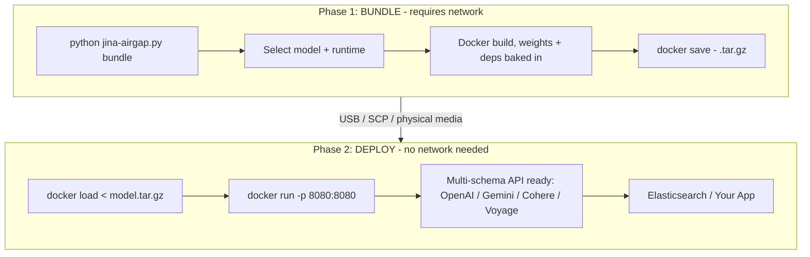

# jina-airgap

Air-gapped deployment toolkit for Jina AI models. Bundle embedding, reranker, and reader models into self-contained Docker images that run fully offline.

> **New here?** The [Quick Start wiki page](https://github.com/jina-ai/jina-airgap/wiki/Quick-Start) gets you to your first `/v1/embeddings` response in 5 minutes using a prebuilt image. Full tutorials, troubleshooting, and the model catalog live in the [wiki](https://github.com/jina-ai/jina-airgap/wiki).




## Quick start

### Already have a prebuilt? Skip bundling

```bash
./scripts/pull-prebuilt.sh jina-embeddings-v5-text-nano cpu
# produces jina-embeddings-v5-text-nano-cpu.tar.gz
# transfer it, then on the offline machine:
docker load < jina-embeddings-v5-text-nano-cpu.tar.gz
docker run -p 8080:8080 jina/jina-embeddings-v5-text-nano:cpu
```

### Bundle from scratch

```bash
python jina-airgap.py list                                       # show all models
python jina-airgap.py bundle                                     # interactive picker
python jina-airgap.py bundle --model jina-embeddings-v5-text-nano --cpu-only --yes
```

Need a builder machine? [`scripts/bootstrap-gcp.sh`](scripts/bootstrap-gcp.sh) provisions one on GCP with Docker + NVIDIA Container Toolkit + the repo pre-cloned.

### Deploy (air-gapped machine)

No repo, no scripts, no Python. Just Docker.

```bash
docker load < MODEL.tar.gz
docker run -p 8080:8080 jina/MODEL:cpu                           # CPU
docker run --gpus all -p 8080:8080 jina/MODEL:gpu                # GPU
curl http://localhost:8080/health
```

Or via docker compose:

```bash
MODEL=jina-embeddings-v5-text-nano RUNTIME=cpu docker compose up -d
# for embed + rerank side-by-side:
docker compose -f docker-compose.multi.yml up -d
```

### Python client

```bash
uv pip install openai requests
python examples/python_client.py
```

Drops in via OpenAI SDK with `base_url="http://your-host:8080/v1"`.

## Models

28 models supported: embeddings (v5, v4, v3, v2), rerankers, readers, ColBERT, CLIP, VLM. All 28 models have prebuilt images. Headline picks:

| Model | Type | Modality | Params | VRAM | Prebuilt |
|---|---|---|---|---|---|
| `jina-embeddings-v5-text-nano` | embedding | text | 239M | ~2GB | [cpu](https://github.com/orgs/jina-ai/packages/container/jina-airgap%2Fjina-embeddings-v5-text-nano/886084948) / [gpu](https://github.com/orgs/jina-ai/packages/container/jina-airgap%2Fjina-embeddings-v5-text-nano/886086707) |
| `jina-embeddings-v5-text-small` | embedding | text | 677M | ~3GB | [cpu](https://github.com/orgs/jina-ai/packages/container/jina-airgap%2Fjina-embeddings-v5-text-small/886085110) / [gpu](https://github.com/orgs/jina-ai/packages/container/jina-airgap%2Fjina-embeddings-v5-text-small/886086903) |
| `jina-embeddings-v3` | embedding | text | 570M | ~3GB | [cpu](https://github.com/orgs/jina-ai/packages/container/jina-airgap%2Fjina-embeddings-v3/893876768) / [gpu](https://github.com/orgs/jina-ai/packages/container/jina-airgap%2Fjina-embeddings-v3/893876917) |
| `jina-embeddings-v5-omni-nano` | embedding | multimodal | 1.04B | ~5GB | [cpu](https://github.com/orgs/jina-ai/packages/container/jina-airgap%2Fjina-embeddings-v5-omni-nano/894208735) / [gpu](https://github.com/orgs/jina-ai/packages/container/jina-airgap%2Fjina-embeddings-v5-omni-nano/894209314) |
| `jina-embeddings-v5-omni-small` | embedding | multimodal | 1.74B | ~8GB | [cpu](https://github.com/orgs/jina-ai/packages/container/jina-airgap%2Fjina-embeddings-v5-omni-small/894209247) / [gpu](https://github.com/orgs/jina-ai/packages/container/jina-airgap%2Fjina-embeddings-v5-omni-small/894209342) |
| `jina-clip-v2` | embedding | multimodal | 865M | ~4GB | [cpu](https://github.com/orgs/jina-ai/packages/container/jina-airgap%2Fjina-clip-v2/886502690) / [gpu](https://github.com/orgs/jina-ai/packages/container/jina-airgap%2Fjina-clip-v2/886416640) |
| `jina-reranker-v3` | reranker | text | 597M | ~3GB | [cpu](https://github.com/orgs/jina-ai/packages/container/jina-airgap%2Fjina-reranker-v3/893272991) / [gpu](https://github.com/orgs/jina-ai/packages/container/jina-airgap%2Fjina-reranker-v3/893273806) |

Full catalog with all 28 models, VRAM, context windows, and licenses: [Model Catalog wiki](https://github.com/jina-ai/jina-airgap/wiki/Model-Catalog) (auto-generated from [`models/catalog.json`](models/catalog.json)).

> CC-BY-NC-4.0 models require a commercial license for production use. Contact [Elastic sales](https://www.elastic.co/contact).

## NVIDIA NIM deployment (alternative)

If you're running on NVIDIA GPU infrastructure and want OpenAI-compatible serving with vLLM optimizations, you can deploy Jina models via [NVIDIA NIM](https://developer.nvidia.com/nim) instead of the standard bundle workflow. This requires an NGC API key and a connected machine on first launch (to pull model weights), but provides CUDA graph optimization and easy model switching:

```bash
export NGC_API_KEY=nvapi-...

# Embeddings on port 8000
docker run -d --name jina-embed --gpus all --shm-size=16GB \
  -p 8000:8000 -v $HOME/nim_cache:/opt/nim/.cache \
  -e NGC_API_KEY=$NGC_API_KEY \
  nvcr.io/nim/nvidia/model-free-nim:2.0.6 \
  hf://jinaai/jina-embeddings-v3 --trust-remote-code

# Reranker on port 8001 (use /rerank endpoint, not /v1/rerank)
docker run -d --name jina-reranker --gpus all --shm-size=16GB \
  -p 8001:8000 -v $HOME/nim_cache:/opt/nim/.cache \
  -e NGC_API_KEY=$NGC_API_KEY \
  nvcr.io/nim/nvidia/model-free-nim:2.0.6 \
  hf://jinaai/jina-reranker-v3 --trust-remote-code
```

See [`scripts/nim-run.sh`](scripts/nim-run.sh) for a helper script and [`docs/NVIDIA-NIM-Deployment.md`](docs/NVIDIA-NIM-Deployment.md) for the full guide including model compatibility, air-gapped NIM deploy, and key flag reference.

## Maximum GPU throughput (`:gpu-opt`)

The default `:gpu` server processes one request at a time on the event loop, so concurrent clients serialize (32 clients ≈ the throughput of 1). For high-QPS serving, the **`:gpu-opt`** tags (text embedding models) add a server-side **dynamic batcher** — a single GPU worker coalesces concurrent requests into length-sorted, token-budgeted batches, so clients can send one input at a time and still saturate the GPU:

```bash
docker run --gpus all -p 8080:8080 \
  ghcr.io/jina-ai/jina-airgap/jina-embeddings-v5-text-nano:gpu-opt   # or -small
```

Same weights and API as `:gpu`; **fp16** by default (matches the stock `:gpu` dtype — zero dtype-induced drift; per-vector cos-sim 0.9999981 vs fp32, batch-invariant). For best throughput clients should request `encoding_format: "base64"` — byte-identical output, far cheaper to serialize (the OpenAI SDK does this by default). Measured end-to-end over HTTP on a single L4 (base64):

| traffic | `:gpu` | `:gpu-opt` |
|---|---|---|
| nano, 32 concurrent × 1 text | 1,267 tok/s | **14,550** (~11×) |
| nano, 64 concurrent (mixed) | 3,000 tok/s | **27,341** (~9×) |
| nano, bulk (4×128) | 16,134 tok/s | **36,415** (2.3×) |
| small, 64 concurrent (mixed) | 1,231 tok/s | **8,738** (~7×) |

This default is **multi-task** — every task (`retrieval`/`text-matching`/`clustering`/`classification`) returns correct embeddings, same as `:gpu`.

**Maximum throughput (single task).** The same image also carries a full single-task stack on top of the batcher — LoRA `merge_and_unload`, `torch.compile` (`emulate_precision_casts`), and a lean tokenize-once pipeline. Merging fixes the model to one task, so it's opt-in via env rather than the default:

```bash
docker run --gpus all -p 8080:8080 \
  -e JINA_MERGE_TASK=retrieval -e JINA_LEAN=1 -e JINA_COMPILE=default \
  ghcr.io/jina-ai/jina-airgap/jina-embeddings-v5-text-nano:gpu-opt
```

nano then reaches **95,428 tok/s on the lowest single L4** (`g2-standard-4`, 4 vCPU — 6.0× the stock `:gpu` server) and **102,195 on `g2-standard-8`**, err=0, per-vector cos-sim 0.9999988 vs fp32. Set `JINA_MERGE_TASK` to `text-matching`/`clustering`/`classification` for those tasks; 200K tok/s on a single L4 is past the chip's lossless ceiling, so use replicas for higher aggregate (see [Sizing & Hardware](https://github.com/jina-ai/jina-airgap/wiki/Sizing-And-Hardware#gpu-dynamic-batching--the-gpu-opt-images)).

Tunable via env (`JINA_BATCH_TOKENS`, `JINA_DTYPE`, `JINA_BATCH_WAIT_MS`, …) with optimal defaults baked in. Full benchmark, tuning, and replica guidance: [Sizing & Hardware → GPU dynamic batching](https://github.com/jina-ai/jina-airgap/wiki/Sizing-And-Hardware#gpu-dynamic-batching--the-gpu-opt-images).

## API at a glance

The server speaks four schemas on the same port simultaneously:

```bash
# OpenAI / Voyage AI
curl http://localhost:8080/v1/embeddings \
  -H 'Content-Type: application/json' \
  -d '{"input": ["Hello world"]}'

# Cohere
curl http://localhost:8080/v1/embed -d '{"texts": ["hi"], "input_type": "search_query"}'

# Google Gemini
curl 'http://localhost:8080/v1/models/MODEL:embedContent' \
  -d '{"content": {"parts": [{"text": "hi"}]}, "taskType": "RETRIEVAL_QUERY"}'

# Reranker
curl http://localhost:8080/v1/rerank \
  -d '{"query": "best embedding model", "documents": ["..."], "top_n": 2}'
```

Tasks (`retrieval`, `text-matching`, `classification`, ...), matryoshka truncation (`dimensions: 128`), and multimodal inputs (omni / clip / vlm models): see the [API Reference wiki](https://github.com/jina-ai/jina-airgap/wiki/API-Reference).

Elasticsearch inference service drop-in: [Elasticsearch integration](https://github.com/jina-ai/jina-airgap/wiki/API-Reference#elasticsearch-integration).

## Licensing (time-sensitive keys)

Optional offline entitlement signal: a signed, expiring key that gives sales/audit a visible "expires on X" control. Fully air-gapped (local HMAC check, no phone-home); issuing/renewing needs **no image rebuild** (key injected at run time).

```bash
python jina-airgap.py keygen --sub acme-corp --days 90        # mint a 90-day key
docker run -e JINA_LICENSE_KEY=JINA-xxx.yyy -p 8080:8080 jina/MODEL:cpu
curl -s http://localhost:8080/health   # shows license status; /health always open
```

**Fail-open by default: a deployed customer is never blocked.** The default `warn` mode always serves - a missing/expired/invalid key only logs and shows in `/health`. Hard 403 blocking is opt-in via `JINA_LICENSE_MODE=enforce` (trials/POCs only), and even then an expired key survives a grace window. Compliance speed-bump, not DRM - the signing secret ships in the image (防君子不防小人). Details: [Licensing wiki](https://github.com/jina-ai/jina-airgap/wiki/Licensing).

## Architecture

**Two-phase model**: bundle (Phase 1, connected) and deploy (Phase 2, offline). Same terminology as zarf, NVIDIA NIM, and Red Hat disconnected install.

- **Zero-dep CLI**: `jina-airgap.py` uses Python stdlib only
- **Weights baked in**: multi-stage Docker build downloads weights at bundle time; `HF_HUB_OFFLINE=1` + `TRANSFORMERS_OFFLINE=1` enforced at runtime
- **Split Dockerfiles**: `Dockerfile.gpu` (pytorch base, CUDA, FP16) and `Dockerfile.cpu` (python:3.11-slim)
- **Per-model pinned deps**: `catalog.json` `deps` field drives exact versions per model
- **Multi-schema API**: OpenAI, Voyage AI, Cohere, Gemini - all active simultaneously
- **GPU auto-detect**: falls back to CPU if no CUDA available
- **Matryoshka**: pass `dimensions` to truncate embeddings to any supported size

### Serve without Docker

If model dependencies are already installed:

```bash
python jina-airgap.py serve --model jinaai/jina-embeddings-v5-text-nano --port 8080
python jina-airgap.py serve --local-path /data/models/jina-v5-nano
```

## Repo structure

```
jina-airgap/
- jina-airgap.py             # CLI: bundle / deploy / serve / list
- models/
  - catalog.json           # 28-model registry with pinned deps
- docker/
  - Dockerfile.gpu         # GPU image (pytorch base, FP16)
  - Dockerfile.cpu         # CPU image (python:3.11-slim)
  - download_model.py      # Model download + patch script (build stage)
- server/
  - app.py                 # FastAPI server: 4 API schemas
  - requirements.txt       # Server framework deps
- scripts/
  - bootstrap-gcp.sh       # one-shot GCP L4 builder provisioner
  - pull-prebuilt.sh       # pull GHCR image + save tar.gz for offline transport
  - gen_catalog_md.py      # regenerate the Model Catalog wiki page
  - benchmark.py           # throughput benchmark
- tests/
  - test_e2e.py            # E2E air-gap tests
- test_airgap.sh             # quick sanity check on a built image
```

## Documentation

- [Quick Start](https://github.com/jina-ai/jina-airgap/wiki/Quick-Start) - 5-minute walkthrough with a prebuilt image
- [Bundling Guide](https://github.com/jina-ai/jina-airgap/wiki/Bundling-Guide) - build your own from a connected machine, GCP L4 walkthrough
- [Model Catalog](https://github.com/jina-ai/jina-airgap/wiki/Model-Catalog) - all 28 models with full metadata
- [API Reference](https://github.com/jina-ai/jina-airgap/wiki/API-Reference) - four schemas, multimodal inputs, tasks, ES integration
- [Troubleshooting](https://github.com/jina-ai/jina-airgap/wiki/Troubleshooting) - common errors and the fixes that work
- [Product & Model Lifecycle (EOL)](https://github.com/jina-ai/jina-airgap/wiki/Product-And-Model-Lifecycle) - how long a deployed model is supported, and why models are maintained differently from software
- [CONTRIBUTING.md](CONTRIBUTING.md) - build/test/push workflow for new bundles
