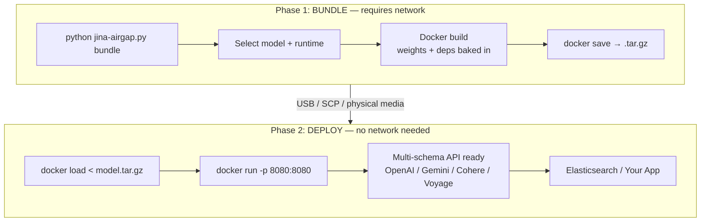

# jina-airgap

Air-gapped deployment toolkit for Jina AI models. Bundle embedding, reranker, and reader models into self-contained Docker images that run fully offline.



## Quick Start

### Bundle (connected machine)

```bash
python jina-airgap.py list                                  # show all models
python jina-airgap.py bundle                                # interactive wizard
python jina-airgap.py bundle --model jina-embeddings-v5-text-nano   # direct
python jina-airgap.py bundle --model jina-embeddings-v5-text-small --cpu-only
```

### Deploy (air-gapped machine)

No repo, no scripts, no dependencies. Just Docker.

```bash
docker load < jina-v5-nano.tar.gz
docker run -p 8080:8080 jina/jina-embeddings-v5-text-nano:cpu       # CPU
docker run --gpus all -p 8080:8080 jina/jina-embeddings-v5-text-nano:gpu  # GPU
curl http://localhost:8080/health
```

### Elasticsearch Integration

```json
PUT _inference/text_embedding/jina-local
{
  "service": "openai",
  "service_settings": {
    "url": "http://your-host:8080/v1/embeddings",
    "model_id": "jina-embeddings-v5-text-nano",
    "api_key": "not-needed"
  }
}
```

## Available Models

28 models. CC-BY-NC-4.0 models require a commercial license for production use — contact [Elastic sales](https://www.elastic.co/contact).

| Model | Type | Modality | Params | VRAM | Context | Dim | Prebuilt |
|-------|------|----------|--------|------|---------|-----|----------|
| jina-embeddings-v5-omni-small | embedding | text/image/audio/video | 1.74B | ~8GB | 32K | 1024 | [cpu](https://github.com/orgs/jina-ai/packages/container/jina-airgap%2Fjina-embeddings-v5-omni-small) / [gpu](https://github.com/orgs/jina-ai/packages/container/jina-airgap%2Fjina-embeddings-v5-omni-small) |
| jina-embeddings-v5-omni-nano | embedding | text/image/audio/video | 1.04B | ~5GB | 8K | 768 | [cpu](https://github.com/orgs/jina-ai/packages/container/jina-airgap%2Fjina-embeddings-v5-omni-nano) / [gpu](https://github.com/orgs/jina-ai/packages/container/jina-airgap%2Fjina-embeddings-v5-omni-nano) |
| jina-embeddings-v5-text-small | embedding | text | 677M | ~3GB | 32K | 1024 | [cpu](https://github.com/orgs/jina-ai/packages/container/jina-airgap%2Fjina-embeddings-v5-text-small) / [gpu](https://github.com/orgs/jina-ai/packages/container/jina-airgap%2Fjina-embeddings-v5-text-small) |
| jina-embeddings-v5-text-nano | embedding | text | 239M | ~2GB | 8K | 768 | [cpu](https://github.com/orgs/jina-ai/packages/container/jina-airgap%2Fjina-embeddings-v5-text-nano) / [gpu](https://github.com/orgs/jina-ai/packages/container/jina-airgap%2Fjina-embeddings-v5-text-nano) |
| jina-vlm | vlm | text/image | 2.4B | ~6GB | 32K | - | - |
| jina-reranker-v3 | reranker | text | 597M | ~3GB | 131K | - | [cpu](https://github.com/orgs/jina-ai/packages/container/jina-airgap%2Fjina-reranker-v3) / [gpu](https://github.com/orgs/jina-ai/packages/container/jina-airgap%2Fjina-reranker-v3) |
| jina-code-embeddings-1.5b | embedding | code | 1.5B | ~4GB | 32K | 1536 | - |
| jina-code-embeddings-0.5b | embedding | code | 494M | ~2GB | 32K | 896 | - |
| jina-embeddings-v4 | embedding | text/image/PDF | 3.8B | ~10GB | 32K | 2048 | - |
| jina-reranker-m0 | reranker | text/image | 2.4B | ~6GB | 10K | - | - |
| ReaderLM-v2 | reader | text | 1.54B | ~4GB | 512K | - | - |
| jina-clip-v2 | embedding | text/image | 865M | ~4GB | 8K | 1024 | - |
| jina-embeddings-v3 | embedding | text | 570M | ~3GB | 8K | 1024 | [cpu](https://github.com/orgs/jina-ai/packages/container/jina-airgap%2Fjina-embeddings-v3) / [gpu](https://github.com/orgs/jina-ai/packages/container/jina-airgap%2Fjina-embeddings-v3) |
| jina-colbert-v2 | colbert | text | 560M | ~3GB | 8K | 128 | - |
| reader-lm-1.5b | reader | text | 1.54B | ~4GB | 256K | - | - |
| reader-lm-0.5b | reader | text | 494M | ~2GB | 256K | - | - |
| jina-reranker-v2-base-multilingual | reranker | text | 278M | ~1GB | 1K | - | - |
| jina-clip-v1 | embedding | text/image | 223M | ~1GB | 8K | 768 | - |
| jina-reranker-v1-turbo-en | reranker | text | 37.8M | ~1GB | 8K | - | - |
| jina-reranker-v1-tiny-en | reranker | text | 33M | ~1GB | 8K | - | - |
| jina-reranker-v1-base-en | reranker | text | 137M | ~1GB | 8K | - | - |
| jina-colbert-v1-en | colbert | text | 137M | ~1GB | 8K | 128 | - |
| jina-embeddings-v2-base-es | embedding | text | 161M | ~1GB | 8K | 768 | - |
| jina-embeddings-v2-base-code | embedding | code | 137M | ~1GB | 8K | 768 | - |
| jina-embeddings-v2-base-de | embedding | text | 161M | ~1GB | 8K | 768 | - |
| jina-embeddings-v2-base-zh | embedding | text | 161M | ~1GB | 8K | 768 | - |
| jina-embeddings-v2-base-en | embedding | text | 137M | ~1GB | 8K | 768 | - |
| jina-embedding-b-en-v1 | embedding | text | 110M | ~1GB | 512 | 768 | - |

## API

The server exposes 4 API schemas simultaneously. No configuration needed.

### OpenAI (+ Voyage AI)

`POST /v1/embeddings` — drop-in for OpenAI Python client and Elasticsearch inference service.

```bash
curl -X POST http://localhost:8080/v1/embeddings \
  -H "Content-Type: application/json" \
  -d '{"input": ["Hello world"], "model": "jina-embeddings-v5-text-nano"}'

# With task
curl -X POST http://localhost:8080/v1/embeddings \
  -H "Content-Type: application/json" \
  -d '{"input": ["search query"], "task": "retrieval.query"}'

# Matryoshka truncation
curl -X POST http://localhost:8080/v1/embeddings \
  -H "Content-Type: application/json" \
  -d '{"input": ["Hello"], "dimensions": 128}'
```

```python
from openai import OpenAI
client = OpenAI(base_url="http://localhost:8080/v1", api_key="not-needed")
resp = client.embeddings.create(model="jina-embeddings-v5-text-nano", input=["Hello world"])
```

Voyage AI fields (`input_type`, `output_dimension`) are also accepted on this endpoint.

### Cohere

`POST /v1/embed`

```bash
curl -X POST http://localhost:8080/v1/embed \
  -H "Content-Type: application/json" \
  -d '{"texts": ["Hello world"], "model": "jina-v5-nano", "input_type": "search_query"}'
```

### Google Gemini

`POST /v1/models/{model}:embedContent` and `POST /v1/models/{model}:batchEmbedContents`

```bash
curl -X POST "http://localhost:8080/v1/models/jina-embeddings-v5-text-nano:embedContent" \
  -H "Content-Type: application/json" \
  -d '{"content": {"parts": [{"text": "Hello world"}]}, "taskType": "RETRIEVAL_QUERY"}'
```

### Voyage AI Multimodal

`POST /v1/multimodalembeddings`

```bash
curl -X POST http://localhost:8080/v1/multimodalembeddings \
  -H "Content-Type: application/json" \
  -d '{"inputs": [{"content": [{"type": "text", "text": "Hello"}]}], "model": "voyage-multimodal-3.5"}'
```

### Multimodal Inputs (Omni Models)

`v5-omni-small`, `v5-omni-nano`, `v4`, `jina-clip-v2` accept images, audio, and video alongside text. All media must be base64-encoded (no URLs — air-gapped by design). Max 10 MB per input.

```bash
# Image embedding (OpenAI schema)
curl -X POST http://localhost:8080/v1/embeddings \
  -H "Content-Type: application/json" \
  -d '{"input": [{"type": "image_base64", "image_base64": {"base64": "<B64>", "mime_type": "image/png"}}]}'

# Fused text + image → one embedding
curl -X POST http://localhost:8080/v1/embeddings \
  -H "Content-Type: application/json" \
  -d '{"input": [{"content": [{"type": "text", "text": "A red square"}, {"type": "image", "format": "base64", "value": "<B64>"}]}]}'
```

Text-only models return HTTP 400 if multimodal inputs are sent.

### Tasks (v5 models)

All v5 embedding models support the `task` parameter: `retrieval` (default), `text-matching`, `classification`, `clustering`. Cohere `input_type` and Gemini `taskType` are mapped automatically.

## Throughput

10s steady-state, batch=32, avg 25 tokens/sentence.

| Model | CPU (8 vCPU Xeon 2.2GHz) | GPU FP16 (L4 24GB) |
|-------|------|----------|--------|------|---------|-----|----------|
| v5-text-nano (239M) | 842 tok/s | 6,523 tok/s |
| v5-text-small (677M) | 38 tok/s | 2,548 tok/s |
| v5-omni-nano (1.04B) | 177 tok/s | 3,828 tok/s |
| v5-omni-small (1.74B) | 43 tok/s | 1,887 tok/s |

GPU uses FP16 by default (`JINA_DTYPE=float16`). The `/health` endpoint reports cumulative throughput stats; each `/v1/embeddings` response includes `usage.tok_per_s`.

## Architecture

**Two-phase model**: bundle (Phase 1, connected) and deploy (Phase 2, offline). Same terminology as zarf, NVIDIA NIM, and Red Hat disconnected install.

- **Zero deps CLI**: `jina-airgap.py` uses Python stdlib only
- **Weights baked in**: multi-stage Docker build downloads weights at bundle time; `HF_HUB_OFFLINE=1` + `TRANSFORMERS_OFFLINE=1` enforced at runtime
- **Split Dockerfiles**: `Dockerfile.gpu` (pytorch/pytorch base, CUDA, FP16) and `Dockerfile.cpu` (python:3.11-slim)
- **Per-model pinned deps**: `catalog.json` `deps` field drives exact versions per model; the `bundle` command generates `model-requirements.txt` automatically
- **Multi-schema API**: OpenAI, Voyage AI, Cohere, Gemini — all active simultaneously
- **GPU auto-detect**: falls back to CPU if no CUDA available
- **Matryoshka**: pass `dimensions` to truncate embeddings to any supported size

### Serve Without Docker

If model dependencies are already installed:

```bash
python jina-airgap.py serve --model jinaai/jina-embeddings-v5-text-nano --port 8080
python jina-airgap.py serve --local-path /data/models/jina-v5-nano
```

## Repo Structure

```
jina-airgap/
├── jina-airgap.py             # CLI tool: bundle / deploy / serve / list
├── models/
│   └── catalog.json           # 28-model registry with pinned deps
├── docker/
│   ├── Dockerfile.gpu         # GPU image (pytorch base, FP16)
│   ├── Dockerfile.cpu         # CPU image (python:3.11-slim)
│   └── download_model.py      # Model download + patch script (build stage)
├── server/
│   ├── app.py                 # FastAPI server: 4 API schemas
│   └── requirements.txt       # Server framework deps
├── scripts/
│   └── benchmark.py           # Throughput benchmark
└── tests/
    └── test_e2e.py            # E2E air-gap tests
```
