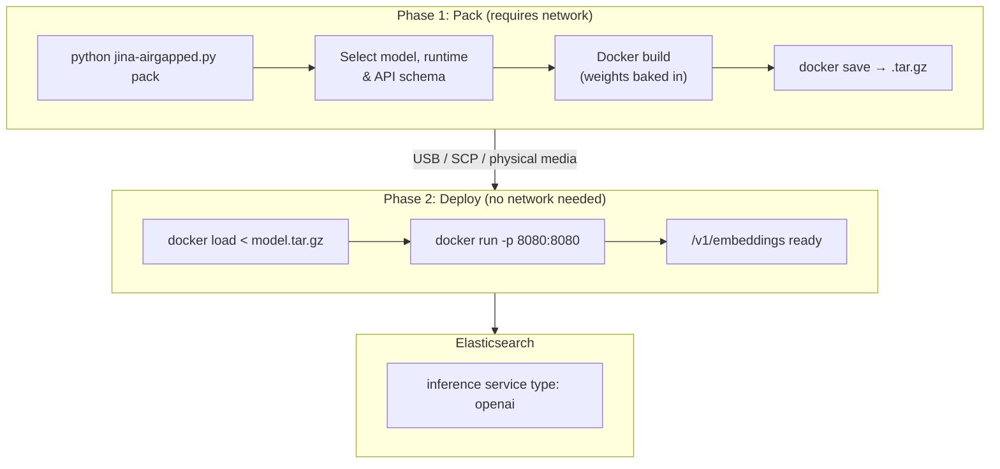

# jina-airgapped

Air-gapped deployment toolkit for Jina AI models. Ship embedding, reranker, and reader models to fully disconnected environments.



## Why

- Customers in regulated/air-gapped environments (gov, finance, healthcare)
- No NVIDIA NIM ($4,500/GPU/yr overkill for embedding models)
- All v5 models fit on a single L4 GPU
- OpenAI-compatible API - drop-in for Elasticsearch inference service
- Real tok/s throughput measurement built in

## Available Models

| Model | Type | Modality | Params | VRAM | Context | Dim |
|-------|------|----------|--------|------|---------|-----|
| jina-embeddings-v3 | embedding | text | 570M | ~3GB | 8K | 1024 |
| jina-embeddings-v4 | embedding | text/image/PDF | 3.8B | ~8GB | 32K | 2048 |
| jina-embeddings-v5-text-nano | embedding | text | 239M | ~2GB | 8K | 768 |
| jina-embeddings-v5-text-small | embedding | text | 677M | ~3GB | 32K | 1024 |
| jina-embeddings-v5-omni-nano | embedding | text/image/audio/video | 1.04B | ~5GB | 8K | 768 |
| jina-embeddings-v5-omni-small | embedding | text/image/audio/video | 1.74B | ~8GB | 32K | 1024 |
| jina-clip-v2 | embedding | text/image | 865M | ~4GB | 8K | 1024 |
| jina-reranker-v3 | reranker | text | 597M | ~3GB | 131K | - |
| ReaderLM-v2 | reader | text | 1.54B | ~4GB | 512K | - |

All models fit on a single L4 GPU (24GB VRAM). Zero phone-home, no license server.

## Throughput

Measured on L4 GPU (CUDA) with `jina-embeddings-v5-text-nano`:

| Mode | Batch | Tok/s |
|------|-------|-------|
| GPU (L4) | 100 | ~4,000-6,000 tok/s |
| CPU | 100 | ~300-800 tok/s |

The `/v1/embeddings` response includes `usage.tok_per_s` - actual tokenizer-counted throughput for each request. The `/health` endpoint reports cumulative stats (avg, peak, total tokens).

## Quick Start

### On a connected machine

```bash
# List available models
python jina-airgapped.py list

# Interactive wizard: select model, build Docker image, save to .tar.gz
python jina-airgapped.py pack

# Or specify directly
python jina-airgapped.py pack --model jina-embeddings-v5-text-nano --output jina-v5-nano.tar.gz

# CPU-only (no GPU at runtime)
python jina-airgapped.py pack --model jina-embeddings-v5-text-small --cpu-only
```

### On the air-gapped machine

```bash
# Transfer the .tar.gz file, then:
docker load < jina-v5-nano.tar.gz
docker run --gpus all -p 8080:8080 jina/jina-embeddings-v5-text-nano:gpu

# CPU only
docker run -p 8080:8080 jina/jina-embeddings-v5-text-nano:cpu

# Or use the helper
python jina-airgapped.py load --image jina-v5-nano.tar.gz --gpu
```

### Test it

```bash
# Health check (includes throughput stats after first request)
curl http://localhost:8080/health

# Embedding
curl -X POST http://localhost:8080/v1/embeddings \
  -H "Content-Type: application/json" \
  -d '{"input": ["Hello world", "Jina AI"], "model": "jina-embeddings-v5-text-nano"}'

# With task parameter (v5 supports all tasks)
curl -X POST http://localhost:8080/v1/embeddings \
  -H "Content-Type: application/json" \
  -d '{"input": ["search query"], "task": "retrieval.query"}'

# Matryoshka truncation
curl -X POST http://localhost:8080/v1/embeddings \
  -H "Content-Type: application/json" \
  -d '{"input": ["Hello"], "dimensions": 128}'
```

The response includes `usage.tok_per_s` with real tokenizer-counted throughput:

```json
{
  "object": "list",
  "data": [{"object": "embedding", "embedding": [...], "index": 0}],
  "model": "jinaai/jina-embeddings-v5-text-nano",
  "usage": {
    "prompt_tokens": 4,
    "total_tokens": 4,
    "tok_per_s": 4823.7
  }
}
```

## Supported Tasks (v5)

All v5 models support the `task` parameter:

- `retrieval.query` (default)
- `retrieval.passage`
- `text-matching`
- `separation`
- `classification`

## Elasticsearch Integration

The API is OpenAI-compatible. Use the `openai` inference service type in Elasticsearch:

```json
PUT _inference/text_embedding/jina-local
{
  "service": "openai",
  "service_settings": {
    "url": "http://your-host:8080/v1/embeddings",
    "model_id": "jina-embeddings-v5-text-nano",
    "api_key": "not-needed"
  }
}
```

## Serve Without Docker

If the model dependencies are already installed:

```bash
python jina-airgapped.py serve --model jinaai/jina-embeddings-v5-text-nano --port 8080

# From local path
python jina-airgapped.py serve --local-path /data/models/jina-v5-nano
```

## Design

- **Zero deps for TUI**: `jina-airgapped.py` uses Python stdlib only for the UI
- **Model baked in**: `HF_HUB_OFFLINE=1` enforced at runtime, no downloads
- **Multi-stage build**: small runtime image, weights in layer
- **GPU auto-detect**: container falls back to CPU if no GPU
- **OpenAI API**: drop-in for any client expecting OpenAI format
- **Matryoshka support**: pass `dimensions` to truncate embeddings
- **Real tok/s**: uses actual tokenizer (not word split) for accurate throughput reporting

## Repo Structure

```
jina-airgapped/
├── README.md
├── jina-airgapped.py     # Main TUI tool (zero external deps for UI)
├── models/
│   └── catalog.json      # Model registry
├── docker/
│   └── embeddings/Dockerfile
├── server/
│   ├── app.py            # FastAPI inference server
│   └── requirements.txt
└── tests/
    └── test_e2e.py       # E2E tests with throughput validation
```
