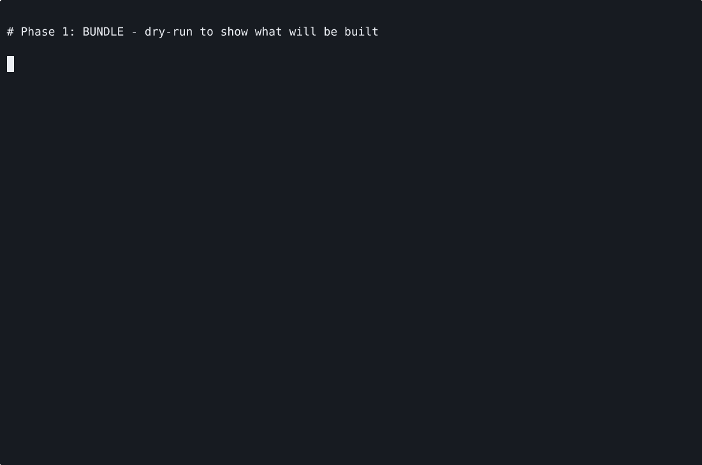
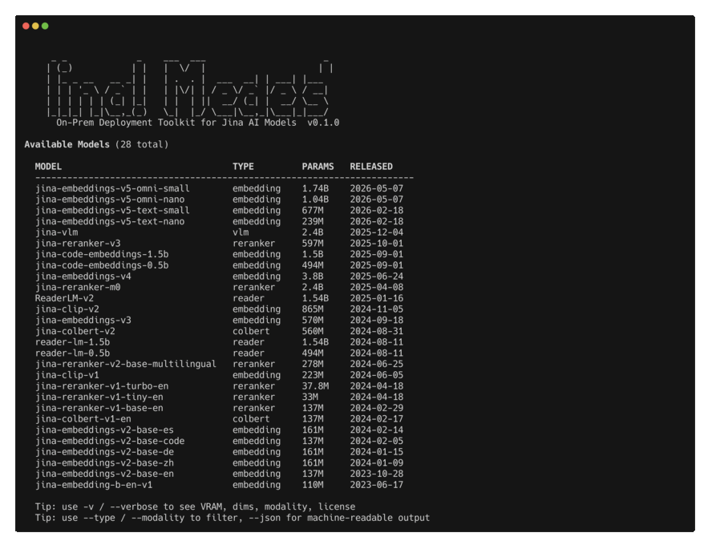

# Bundling Guide

How to build your own bundle from scratch. Use this when:

- The model you want isn't in the [prebuilt list](Model-Catalog)
- You need to pin different dependency versions
- Your customer's policy forbids `docker pull` from third-party registries

Output: a single self-contained `.tar.gz`. Bundle once, transfer, run forever offline.

```mermaid
flowchart TB
    classDef bundle fill:#fff3d6,stroke:#c08800
    classDef hop fill:#e8f0ff,stroke:#3b6ad6
    classDef deploy fill:#d9f5e0,stroke:#1f8f3a

    A[Connected builder machine
needs internet + Docker]:::bundle --> B[python jina-airgap.py bundle
--model X]
    B --> C[Stage 1 of Docker build
download weights from HF Hub
patch model code]
    C --> D[Stage 2 of Docker build
install pinned deps
add server/app.py
set HF_HUB_OFFLINE=1]
    D --> E[docker save MODEL | gzip
> jina-MODEL-cpu.tar.gz]
    E --> F[Transfer via SCP, USB,
or approved channel]:::hop
    F --> G[Air-gapped host
needs Docker only]:::deploy
    G --> H[docker load < tar.gz
docker run -p 8080:8080]
```

## Prerequisites (connected machine)

| Requirement | Notes |
|---|---|
| Linux x86_64 | Ubuntu 22.04 tested. macOS works via Docker Desktop but slow |
| Docker 24+ with BuildKit | comes with modern Docker |
| Python 3.10+ | CLI is single-file, stdlib only |
| Disk: 30 GB+ | 200 GB if bundling multiple models |
| Network | bundle phase pulls weights from HuggingFace |
| For GPU bundles | no GPU needed at build time; Dockerfile uses pre-built PyTorch CUDA base |



## Path A: bundle on GCP L4 (recommended)

The repo ships [`scripts/bootstrap-gcp.sh`](https://github.com/jina-ai/jina-airgap/blob/main/scripts/bootstrap-gcp.sh), a one-shot provisioner. It creates a `g2-standard-4` + L4 instance with Docker + NVIDIA Container Toolkit + the repo pre-cloned:

```bash
git clone https://github.com/jina-ai/jina-airgap.git
cd jina-airgap
./scripts/bootstrap-gcp.sh                                   # defaults
GPU_COUNT=0 MACHINE_TYPE=e2-standard-4 ./scripts/bootstrap-gcp.sh   # CPU-only builder
PROJECT=other-proj ZONE=us-east4-a ./scripts/bootstrap-gcp.sh        # different project/zone
```

> **L4 stockouts are common in popular US zones**. If the script errors with "does not have enough resources", retry in `us-west1-a`, `us-east4-a`, `europe-west4-a`, or `asia-southeast1-a`. See [Troubleshooting -> L4 stockout](Troubleshooting#l4-stockout).

After provisioning, the script prints the SSH command. From inside:

```bash
cd ~/jina-airgap
sg docker -c 'python3 jina-airgap.py bundle --model jina-embeddings-v5-text-nano --cpu-only --yes'
```

`sg docker -c '...'` is only needed in the same session that installed Docker. After SSH reconnect, plain `docker` works.

## Path B: bundle on your own machine

Any Linux box with Docker. Skip the GCP step:

```bash
git clone https://github.com/jina-ai/jina-airgap.git
cd jina-airgap
python3 jina-airgap.py bundle --model jina-embeddings-v5-text-nano --cpu-only --yes
```

## CLI commands



```bash
python3 jina-airgap.py list                              # all models
python3 jina-airgap.py list --type embedding --verbose   # filter + extras
python3 jina-airgap.py list --json                       # machine-readable

python3 jina-airgap.py bundle                            # interactive picker
python3 jina-airgap.py bundle --model MODEL              # GPU runtime
python3 jina-airgap.py bundle --model MODEL --cpu-only   # CPU image
python3 jina-airgap.py bundle --model MODEL --yes        # non-interactive (CI)

python3 jina-airgap.py deploy --image PATH.tar.gz        # load + run (testing)
python3 jina-airgap.py serve --model MODEL               # no Docker, requires deps installed
```

Backward-compatible aliases: `pack` -> `bundle`, `load` -> `deploy`.

## Output

A successful bundle produces:

```
jina-embeddings-v5-text-nano-cpu.tar.gz       # for --cpu-only
jina-embeddings-v5-text-small-gpu.tar.gz      # for GPU runtime
```

Sizes: 2-4 GB for nano/small text models, up to ~8 GB for v5-text-small GPU, up to ~12 GB for omni/v4.

## CPU vs GPU runtime

|  | CPU image | GPU image |
|---|---|---|
| Base image | `python:3.11-slim` | `pytorch/pytorch:2.5.1-cuda12.1-cudnn9-devel` |
| Image size | smaller (~2-4 GB) | larger (~8-12 GB) |
| Runs on host with GPU | yes (ignores GPU) | yes |
| Runs on host without GPU | yes | no (CUDA missing) |
| Inference speed | ~10x slower | full speed |
| Build wall-clock | ~3-15 min | ~10-30 min |

If unsure, build both. The runtime host decides which to load.

## Bundle wall-clock examples

Measured on `g2-standard-4` (4 vCPU + 1xL4) in `asia-southeast1-a` (May 2026):

| Model | Runtime | Build time | Output size |
|---|---|---|---|
| jina-embeddings-v5-text-nano | cpu | 3.5 min | 766 MB |
| jina-embeddings-v5-text-small | gpu | 14 min | 4.4 GB |

GPU bundle wall-clock is dominated by the pytorch CUDA base image pull (~6 GB).

## Disk hygiene during multi-model builds

Each bundle accumulates: built image + tarball + BuildKit cache. Reclaim between bundles:

```bash
docker builder prune -af      # reclaim BuildKit cache (always safe)
docker system prune -f        # remove dangling layers
rm jina-OLDMODEL-*.tar.gz     # remove tars you've already transferred
df -h /                       # confirm
```

The [`CONTRIBUTING.md` batch-build pattern](https://github.com/jina-ai/jina-airgap/blob/main/CONTRIBUTING.md#batch-build-all-6-priority-models) iterates this for all 6 priority models on a single host.

## Transfer to the air-gapped machine

The `.tar.gz` is one self-contained file. Move it however your policy allows:

| Channel | Notes |
|---|---|
| SCP | fastest if both ends are on a routable network |
| SFTP / FTPS | if SCP is blocked |
| Object storage (S3, GCS) | if the air-gapped side can reach it |
| USB / removable disk | true air-gap, sneakernet |
| Optical media (DVD, BD-R) | maximum-security customer DC |
| Whatever Change Management approves | most regulated customers have a fixed channel |

On the target host:

```bash
docker load < jina-MODEL-cpu.tar.gz
docker run -d -p 8080:8080 jina/MODEL:cpu
curl http://localhost:8080/health
```

That's the entire air-gapped deploy. The image has `HF_HUB_OFFLINE=1` and `TRANSFORMERS_OFFLINE=1` baked in - any code path that would call out to HuggingFace fails immediately rather than silently downloading.

## Caveats worth knowing before you build

- Each model's `transformers` version is pinned. See [Troubleshooting -> Transformers version pins](Troubleshooting#transformers-version-pins).
- Reranker models load as `CrossEncoder`, not `SentenceTransformer`. Handled in the server, relevant only if you `serve` directly.
- v5-omni models need ~30 GB free disk during build (large base + flash-attn compile).
- The bundle deletes each model repo's `requirements.txt` to prevent runtime auto-upgrade. This is intentional.

Full debug history: [CONTRIBUTING.md "Known Caveats"](https://github.com/jina-ai/jina-airgap/blob/main/CONTRIBUTING.md#known-caveats-from-hard-won-debugging).

## Next

- [Quick Start](Quick-Start) - test the bundle you just built
- [API Reference](API-Reference) - what the server exposes
- [Troubleshooting](Troubleshooting) - build and deploy errors
