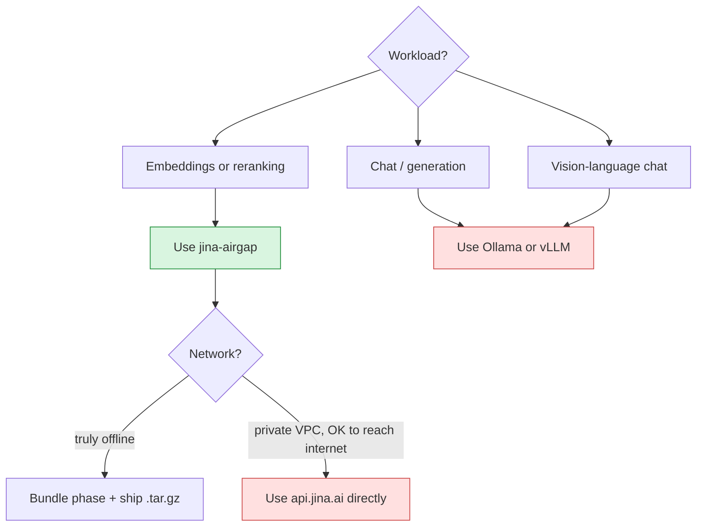
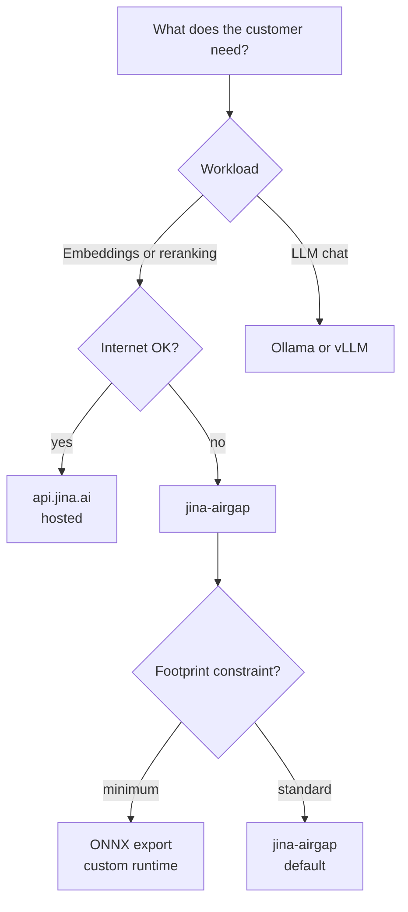

Customers and SAs frequently ask "why not just use X?". Short answer for each.

## jina-airgap vs Ollama

**Ollama** is a great LLM server. It loads GGUF/Q4 quantized chat models and exposes a chat API.

| | Ollama | jina-airgap |
|---|---|---|
| Workload | LLM chat / generation | embeddings, reranking, readers |
| Model format | GGUF (llama.cpp) | full PyTorch / SentenceTransformers |
| Quantization story | aggressive (Q4_K_M is default) | bundle ships original precision |
| Out-of-the-box embeddings | yes for some models, but not Jina-quality | yes, Jina v5/v4/v3 |
| Out-of-the-box reranking | no | yes (`/v1/rerank`) |
| Multi-schema API | OpenAI only | OpenAI + Cohere + Gemini + Voyage |
| Air-gap story | run offline, but you still pull models from ollama.com | full air-gap bundling |
| Sweet spot | LLM chat at the edge | embeddings + reranking in regulated environments |

**Use Ollama for LLM chat. Use jina-airgap for embeddings/reranking.** Run both on the same host if your customer needs both.

## jina-airgap vs vLLM

**vLLM** is a high-throughput LLM inference server with PagedAttention, continuous batching, etc.

| | vLLM | jina-airgap |
|---|---|---|
| Workload | LLM chat at scale | embeddings, reranking |
| Throughput optimization | PagedAttention, continuous batching | batched SentenceTransformer.encode |
| Multi-GPU sharding | tensor parallelism, pipeline parallelism | one model per container |
| OpenAI compat | yes (chat completions) | yes (embeddings) |
| Air-gap story | works offline if you preload, no toolchain | full bundle-and-transfer toolchain |
| Multimodal | growing (image-text models) | yes (clip-v2, v4, omni, vlm) |

**Different workloads.** vLLM is for chat at high QPS. jina-airgap is for the search side of RAG.

## jina-airgap vs ONNX export

**ONNX** lets you export a PyTorch model to a portable runtime and serve via onnxruntime.

| | ONNX export | jina-airgap |
|---|---|---|
| Runtime size | small (no PyTorch) | larger (full PyTorch + deps) |
| Inference speed | often faster on CPU | comparable to PyTorch |
| Model fidelity | depends on export quality - LoRA adapters and custom code paths often break | matches HF Hub reference implementation byte-for-byte |
| Quantization | INT8 supported | possible at build time, not the default |
| Custom code (Jina's modeling_*.py) | usually drops | kept |
| Multi-schema API wrapping | DIY | included |
| Update cycle | re-export per upstream | rebundle |

**Use ONNX when you've validated the export matches the reference output and you need the smallest footprint.** Use jina-airgap when you want guaranteed parity with the published model and don't want to maintain an export pipeline.

## jina-airgap vs hosted Jina API (api.jina.ai)

**api.jina.ai** is Jina's hosted inference endpoint. Easiest path if the customer can reach the internet.

| | Hosted (api.jina.ai) | jina-airgap |
|---|---|---|
| Time to first request | under 1 minute (API key + curl) | minutes (pull + run) to hours (bundle) |
| Data leaves customer | yes | no |
| Works with no internet | no | yes |
| Per-request cost | pay-as-you-go | hardware only |
| Latency | network RTT to Jina | localhost / LAN |
| Audit story | vendor compliance | customer owns the artifact |
| Customer holds weights | no | yes |

**Use hosted when the customer can reach api.jina.ai and pay per request.** Use jina-airgap when they can't, or won't.

## jina-airgap vs custom Docker image (DIY)

You could build your own Docker image with HF transformers and the model weights. What does jina-airgap add?

- **Pinned deps per model** with documented reasons (see CONTRIBUTING.md "Known Caveats")
- **Multi-schema API** (OpenAI + Cohere + Gemini + Voyage) - 1000+ lines of `server/app.py` you don't have to write
- **Patched custom code** for offline use (delete model repo requirements.txt, monkeypatch `trust_remote_code`)
- **Tested workflow** for 28 models including the gnarly ones (omni multimodal, Qwen3-based rerankers, ColBERT, ReaderLM, VLM)
- **Maintained**: when upstream changes break a model, the catalog is updated and a new bundle is shipped

DIY is a valid path if you're customizing heavily. jina-airgap is the curated default.

## When to use what - decision tree

## Picking for an evaluator

The fastest "show me it works" demo path:

1. Pull `jina-embeddings-v5-text-nano:cpu` from GHCR (5 min)
2. `docker run` on the customer's laptop or a test VM
3. `curl /v1/embeddings`
4. Open `/docs` (FastAPI swagger UI) to show all 4 schemas

If the customer wants to compare with another vendor: build the same `.tar.gz` for a second model (v3 or v4), put them side by side. Different bundle = different model, same runtime contract.

## Next

- [Why Air-Gap](Why-Airgap) - when air-gap is the right choice
- [Customer Scenarios](Customer-Scenarios) - applied playbooks
- [Sizing & Hardware](Sizing-And-Hardware) - capacity for the chosen path
