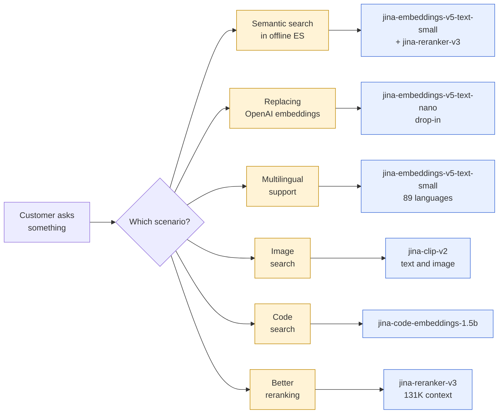

Concrete playbooks for the most common customer situations. Each scenario walks through: what the customer asked for, which model to recommend, what hardware to size, and how to deploy.



## Scenario A - Offline semantic search in Elasticsearch

**Customer**: a bank with an on-prem ES cluster, indexing internal research notes. No outbound internet.

**Recommend**: `jina-embeddings-v5-text-small` (multilingual, 1024-dim) for indexing + `jina-reranker-v3` for top-K reranking. Both fit on a single L4.

**Hardware**: 1x NVIDIA L4 (24GB VRAM) per host, 100GB disk for both bundles + cache. Two replicas behind a load balancer if QPS > 50.

**Deploy**:
1. On a connected machine, run `./scripts/pull-prebuilt.sh jina-embeddings-v5-text-small gpu` and `./scripts/pull-prebuilt.sh jina-reranker-v3 gpu`. Output: two `.tar.gz` files.
2. Transfer both to the air-gapped host (SCP, USB, or whatever the bank's change-control allows).
3. `docker load < ...` and `docker run --gpus all -p 8080:8080 ...` for each on different ports.
4. Wire ES inference service to both:

```json
PUT _inference/text_embedding/jina-embed
{"service": "openai", "service_settings": {
  "url": "http://embed-host:8080/v1/embeddings",
  "model_id": "jina-embeddings-v5-text-small",
  "api_key": "not-needed"
}}

PUT _inference/rerank/jina-rerank
{"service": "cohere", "service_settings": {
  "url": "http://rerank-host:8081/v1/rerank",
  "model_id": "jina-reranker-v3",
  "api_key": "not-needed"
}}
```

5. Index documents through the embedding inference and use the reranker on top-50 retrieval.

## Scenario B - Drop-in replacement for OpenAI embeddings

**Customer**: a SaaS company whose paying customers refuse to send their data to OpenAI.

**Recommend**: `jina-embeddings-v5-text-nano` (CPU-friendly, 768-dim). The smallest model that's still a credible quality replacement.

**Hardware**: CPU is fine for < 100 QPS - 4 vCPU + 4GB RAM. Add a GPU only if latency is critical.

**Deploy**: 5 lines of bash:
```bash
docker load < jina-embeddings-v5-text-nano-cpu.tar.gz
docker run -d -p 8080:8080 jina/jina-embeddings-v5-text-nano:cpu
```

**Client change** - just rebase the OpenAI SDK URL:
```python
from openai import OpenAI
client = OpenAI(base_url="http://your-host:8080/v1", api_key="not-needed")
client.embeddings.create(model="jina-embeddings-v5-text-nano", input=["Hello"])
```

That's it. No application code change beyond `base_url`.

## Scenario C - Multilingual support across 89 languages

**Customer**: a global support-ticket triage system that must work in English, German, Spanish, Chinese, Japanese, Arabic.

**Recommend**: `jina-embeddings-v5-text-small`. Trained on 89 languages with task-aware routing.

**Sizing**: ~3GB VRAM, fits anywhere. L4 or T4 if GPU.

**Tip**: use the `task` field. `retrieval` for semantic search, `classification` for the triage classifier, `clustering` for grouping similar tickets. See [API Reference -> Embedding tasks](API-Reference#embedding-tasks).

## Scenario D - Image and text search

**Customer**: a fashion retailer that wants visual + text search ("red dress like this image, but in cotton").

**Recommend**: `jina-clip-v2` (multimodal embeddings, text and image in the same space).

**Hardware**: ~4GB VRAM. L4 minimum if you want < 100ms image embedding.

**API call** (image + text fused into a single embedding):

```bash
curl http://host:8080/v1/embeddings \
  -H "Content-Type: application/json" \
  -d '{"input": [{"content": [
    {"type": "text", "text": "cotton dress"},
    {"type": "image", "format": "base64", "value": "<BASE64>"}
  ]}]}'
```

Image must be base64-encoded inline (no URLs - the air-gap forbids outbound fetches). Max 10 MB per input.

## Scenario E - Code search

**Customer**: dev tools company indexing 10M code files for repo search.

**Recommend**: `jina-code-embeddings-1.5b` (code-aware, 1536-dim) or `0.5b` for lighter deploys.

**Hardware**: 1.5b needs ~4GB VRAM. 0.5b runs on CPU for low-volume.

**Tip**: build per-language indexes, then query with `task: "retrieval"`. Code-specific reranking with `jina-reranker-v3` on top of the top-100.

## Scenario F - Better reranking on top of existing retrieval

**Customer**: already has a retrieval pipeline (BM25 or any embedding model), wants to add a strong reranker.

**Recommend**: `jina-reranker-v3` (131K context, multilingual, top-quality).

**Hardware**: ~3GB VRAM. CPU works for top-K < 50, GPU for higher volumes.

**Deploy** alongside existing system, no changes to retrieval:

```bash
curl http://rerank-host:8080/v1/rerank \
  -H "Content-Type: application/json" \
  -d '{
    "query": "best vector database for embeddings",
    "documents": ["...top 50 from your retriever..."],
    "top_n": 10
  }'
```

131K context means you can pass long documents (full pages, transcripts) without chunking.

## Scenario G - Hospital with HIPAA + sovereign data

**Customer**: hospital with patient records, must run in their data center, no AI vendor allowed.

**Recommend**: `jina-embeddings-v5-text-nano` or `text-small`. The smallest workable model lowers the audit/security review burden.

**Compliance pitch**:
- "Model weights and dependencies are on customer hardware. We do not see your data or your queries."
- "Container has `HF_HUB_OFFLINE=1` and `TRANSFORMERS_OFFLINE=1` set - no path exists for the model to fetch anything at runtime."
- "Image is built once on a connected machine, transferred under your change-control process, run on offline machines indefinitely."
- "No license server, no phone-home, no telemetry."
- "Source code is on GitHub (Apache-2.0 for the CLI), reviewable by your security team."

Pair this with [Why Air-Gap -> What "air-gap" means in this project](Why-Airgap#what-air-gap-means-in-this-project) when responding to the customer's security questionnaire.

## Next

- [Picking a Model](Picking-A-Model) - decision tree for model selection
- [Sizing & Hardware](Sizing-And-Hardware) - capacity planning per model
- [Quick Start](Quick-Start) - hands-on first-deploy walkthrough
