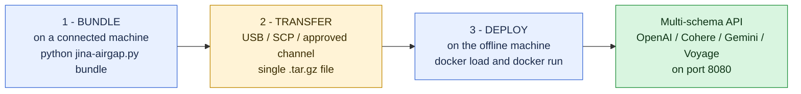

# jina-airgap

**Deploy Jina AI's embedding, reranker, and reader models inside customer environments that cannot reach the internet.**

For sales/SA/field engineers walking a customer through their first deployment, start with **[Why Air-Gap](Why-Airgap)**, then **[Quick Start](Quick-Start)**. For developers integrating the API into an application, start with **[API Reference](API-Reference)**.

## At a glance

That's the whole product. The connected machine has internet to fetch model weights and dependencies. Everything is baked into a single Docker image and exported as a `.tar.gz`. The offline machine only needs Docker.

## What's supported

- **28 models**: Jina embeddings (v5, v4, v3, v2), rerankers, ColBERT, CLIP, ReaderLM, VLM. See [Model Catalog](Model-Catalog).
- **4 API schemas simultaneously**: OpenAI, Cohere, Google Gemini, Voyage AI - drop-in for any client.
- **Multimodal**: text + image + audio + video on omni/clip/v4 models.
- **GPU and CPU**: same model can be packaged either way.
- **Elasticsearch inference service**: works as a `service: openai` endpoint out of the box.

## Pick your starting point

| You are... | Start here |
|---|---|
| An SA/sales engineer evaluating jina-airgap for a customer | [Why Air-Gap](Why-Airgap), then [Customer Scenarios](Customer-Scenarios) |
| A field engineer deploying at a customer site | [Quick Start](Quick-Start), then [Sizing & Hardware](Sizing-And-Hardware) |
| A developer integrating the API | [API Reference](API-Reference) |
| Building a new bundle from scratch | [Bundling Guide](Bundling-Guide) |
| Hitting an error | [Troubleshooting](Troubleshooting), [FAQ](FAQ) |

## License note

Most Jina v5/v4/v3 models are **CC-BY-NC-4.0**: commercial use needs a license. Contact [Elastic sales](https://www.elastic.co/contact). v2 and v1 models are Apache-2.0 and free for any use. Per-model license is in the [Model Catalog](Model-Catalog).
