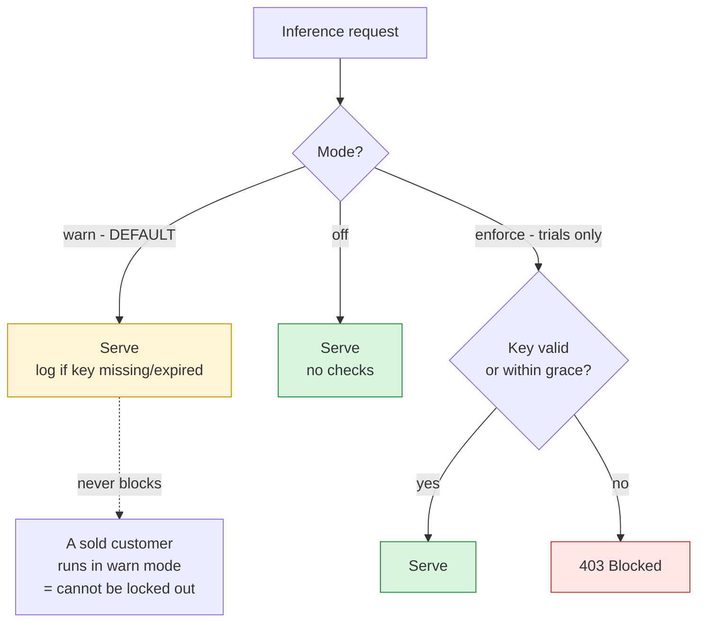
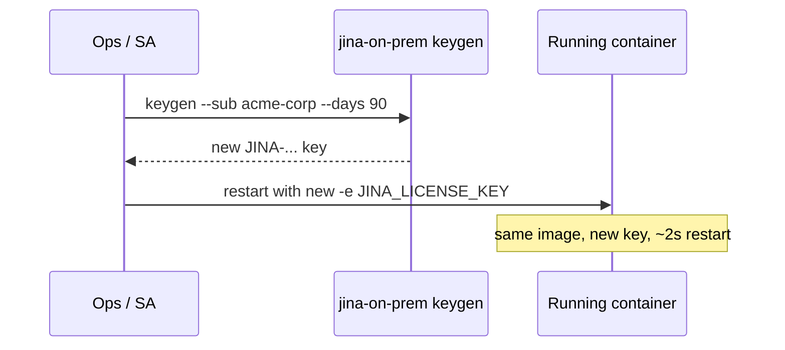

How licensing works for self-managed (SM) / air-gapped Jina AI deployments, and how the optional built-in **time-bound license key** lets you show an auditor a concrete, expiring entitlement control without ever risking a customer outage. This page is written for the field: sales engineers, solutions architects, procurement, and security reviewers. It explains, step by step, what the key does, how to issue one, how to deploy with it, what it can and cannot do, and exactly why a paying customer can never be locked out by it.

> **Read this first.** There are two separate things here, and confusing them causes most of the noise. (1) **The commercial license** is the contract that grants a customer the right to run a CC-BY-NC-4.0 model in production - obtained through Elastic sales. That is what actually governs usage. (2) **The license key** described on this page is an *optional technical convenience*: a small, offline, expiring token you can hand to a deployment so that ops and audit can see "this instance carries an entitlement that expires on date X". It is a **speed-bump for honest process compliance, not a lock** (防君子不防小人). The customer holds the model weights, so there is nothing to truly lock - and by design, **the key defaults to a mode that never blocks a running deployment.** If you take one thing from this page: *turning on a license key can never take a paying customer offline.*

## Contents

- [The two kinds of "license"](#the-two-kinds-of-license)
- [What the license key is (and is not)](#what-the-license-key-is-and-is-not)
- [The golden rule: a paying customer is never blocked](#the-golden-rule-a-paying-customer-is-never-blocked)
- [The three modes](#the-three-modes)
- [Step by step: issue and deploy a key](#step-by-step-issue-and-deploy-a-key)
- [Renewing a key (no rebuild)](#renewing-a-key-no-rebuild)
- [Capability boundaries: what it can and cannot do](#capability-boundaries-what-it-can-and-cannot-do)
- [How it works under the hood](#how-it-works-under-the-hood)
- [Environment variables reference](#environment-variables-reference)
- [FAQ](#faq)

## The two kinds of "license"

| | Commercial license (the contract) | License key (this page) |
|---|---|---|
| What it is | The legal right to run the model in production | An optional offline token with an expiry date |
| Who issues it | Elastic sales | You, with one CLI command (`jina-on-prem.py keygen`) |
| Where it lives | The customer's contract / order form | An env var passed at `docker run` time |
| What it governs | Actual usage rights | A visible, checkable "expires on X" signal |
| Enforced by software? | No | Optionally, and never against a sold customer |
| Needed to run the container? | The contract must exist | **No** - the container runs with or without a key |

Everything below is about the second column. The first column is unchanged by any of this.

## What the license key is (and is not)

**It is:**
- A single-line, copy-paste token, e.g. `JINA-eyJ...` .
- **Time-bound**: it carries an expiry date inside it.
- **Fully offline**: the server checks it locally (an HMAC signature check). No license server, no internet, no phone-home. This is what makes it safe for air-gapped and regulated environments.
- **Runtime-injected**: you pass it with `-e JINA_LICENSE_KEY=...` at `docker run`. Issuing or renewing a key **never rebuilds the image**.

**It is not:**
- **Not DRM.** The signing secret ships inside the image, so anyone technical can mint or bypass a key. This is intentional. It stops honest drift ("oh, this POC lapsed"), not a determined actor.
- **Not a kill switch.** By default it cannot stop a deployment from serving (see the golden rule).
- **Not the thing that grants usage rights.** That is the commercial license.

## The golden rule: a paying customer is never blocked

This is the design's number-one constraint, above every other feature:

> **A paying, already-deployed customer must never be blocked by the license key - not by a missing key, an expired key, a corrupted key, or a wrong system clock.**

The mechanism enforces this by defaulting to **fail-open**. Out of the box (no configuration), the server treats the key as an *advisory signal*: it always answers requests, and a missing or expired key produces only a log line and a field in `/health`. You have to *explicitly opt in* to any blocking behaviour, and that opt-in is intended only for time-boxed trials and POCs - never for sold deployments.



Ship every sold, air-gapped customer in the **default (warn) mode**. They can run with no key at all, forever, and nothing breaks. The key is there so that *if* an auditor asks "show me an entitlement that expires", you can point at `/health` and the log line.

## The three modes

Set with the `JINA_LICENSE_MODE` environment variable.

| Mode | Behaviour | Blocks on bad/missing key? | Use it for |
|---|---|---|---|
| **`warn`** (default) | Fail-open. Always serves. Logs + reports key state in `/health`. | **Never** | **Sold, deployed customers.** This is the safe default. |
| **`enforce`** | Fail-closed. Returns HTTP 403 on inference endpoints when the key is missing / expired (past grace) / invalid. | Yes (after grace) | **Time-boxed trials and POCs** where you *want* access to lapse. |
| **`off`** | No checking at all, no logging. | Never | When you want the feature completely invisible. |

Even in `enforce` mode there is a **grace window** (default 14 days, `JINA_LICENSE_GRACE_DAYS`): an expired key keeps working while logging loudly, so clock skew or a slow renewal never causes a hard cutoff on a day boundary. Set it to `0` for a strict cutoff at expiry.

## Step by step: issue and deploy a key

**1. Mint a key** (on any machine with the repo; no Docker, no network needed):

```bash
python jina-on-prem.py keygen --sub "acme-corp" --days 90
```

Output (the key prints to stdout):

```
License key minted
  Licensed to: acme-corp
  Model scope: *
  Valid days:  90
  Expires:     2026-10-04 22:00:00Z

JINA-eyJleHAiOjE3OTE...   <- this is the key
```

Options:

| Flag | Meaning | Default |
|---|---|---|
| `--sub` | Who the key is issued to (shown in `/health` and logs) | required |
| `--days` | Validity window in days | 30 |
| `--model` | Restrict the key to one model id (else any model) | `*` (any) |
| `--secret` | Sign with a custom secret (must match the server's `JINA_LICENSE_SECRET`) | public default |
| `--json` | Emit key + claims as JSON | off |

**2. Deploy with the key** (default warn mode - never blocks):

```bash
docker run -e JINA_LICENSE_KEY="JINA-eyJleHAiOjE3OTE..." \
  -p 8080:8080 jina/jina-embeddings-v5-text-nano:cpu
```

**3. Verify** (no key required to read health):

```bash
curl -s http://localhost:8080/health | python3 -m json.tool
```

```json
{
  "status": "ok",
  "license": {
    "mode": "warn",
    "valid": true,
    "fail_open": true,
    "licensed_to": "acme-corp",
    "expires": "2026-10-04T22:00:00Z",
    "days_left": 89.9
  }
}
```

That `license` block is exactly what you show an auditor: a concrete, expiring, machine-checkable entitlement - produced entirely offline.

**(Optional) Trial with real expiry** - only for POCs you *want* to lapse:

```bash
docker run -e JINA_LICENSE_KEY="JINA-..." \
  -e JINA_LICENSE_MODE=enforce \
  -p 8080:8080 jina/jina-embeddings-v5-text-nano:cpu
```

## Renewing a key (no rebuild)

Renewal is deliberately trivial - it never touches the image:



1. `python jina-on-prem.py keygen --sub "acme-corp" --days 90`
2. Restart the container with the new `JINA_LICENSE_KEY`.

No `docker build`, no re-transfer of the multi-GB bundle, no downtime beyond a container restart (and with the blue/green pattern in [Versioning & Updates](Versioning-And-Updates), zero downtime).

## Capability boundaries: what it can and cannot do

Be honest about this with customers and auditors - overselling it is how you lose trust in a security review.

| Capability | Supported? | Notes |
|---|---|---|
| Show an entitlement that expires on a date | Yes | Visible in `/health` and logs |
| Work fully offline / air-gapped | Yes | Local HMAC check, no network |
| Issue / renew without rebuilding the image | Yes | Runtime env var |
| Restrict a key to a specific model | Yes | `keygen --model <id>` |
| Optionally block access after expiry (trials) | Yes | `enforce` mode + grace window |
| Never block a paying deployment | Yes | Default `warn` mode is fail-open |
| Stop a determined user from running the model | **No** | Secret ships in the image; by design (防君子不防小人) |
| Cryptographically prove entitlement (real DRM) | **No** | Would need asymmetric signing + key custody; a deliberate non-goal |
| Meter usage / count tokens / bill | **No** | Out of scope; this is an expiry signal, not a meter |
| Phone home or report usage | **No** | Never - that would break the air-gap guarantee |

If a customer genuinely needs a hard cryptographic lock, that is a different product decision (asymmetric signing so the image can verify but not mint keys). It is intentionally not built here, because the customer holds the weights and could always re-bundle them from their licensed source - so a hard lock would add key-management pain for no real control.

## How it works under the hood

For the security reviewer who wants the mechanism, not marketing:

- **Key = signed token with an embedded expiry.** The payload is a small JSON object `{"sub", "iat", "exp", "model", "v"}`, base64url-encoded, followed by an **HMAC-SHA256** signature. This is the same primitive as a signed JWT with an `exp` claim - the industry-standard way to validate a license **offline**.
- **Validation is a local compare.** The server recomputes the HMAC with its secret and constant-time-compares it, then checks `exp` against the system clock and (optionally) the model scope. No network call, ever.
- **Why not TOTP / Google Authenticator?** TOTP (RFC 6238) generates rotating 30-second one-time codes for interactive 2FA against a live verifier. It is the wrong tool for a durable, offline, multi-month license window - there is no interactive login and no live verifier in an air-gapped box. A signed token with an `exp` is the correct shape.
- **Why symmetric HMAC with a public secret?** Because the goal is 防君子不防小人, not DRM. The secret ships in the image so `keygen` and the server agree without any key distribution. If a real lock were ever required, the minimal upgrade is **asymmetric (e.g. Ed25519)**: ship only the *public* key in the image so it can verify but not mint, and keep the private key on the issuing side. That is a deliberate non-goal today.
- **Fail-open is enforced in one place.** A single `decide()` function is the only authority on whether to serve; in `warn`/`off` it always returns "allow", and even in `enforce` an expired key is allowed through the grace window. Validation is wrapped so that any unexpected error also fails open. There is no code path where a default-configured server refuses a request because of the key.

## Environment variables reference

| Variable | Default | Purpose |
|---|---|---|
| `JINA_LICENSE_KEY` | (empty) | The key to present. Empty is fine in `warn`/`off`. |
| `JINA_LICENSE_MODE` | `warn` | `warn` (fail-open, default), `enforce` (trials), or `off`. |
| `JINA_LICENSE_GRACE_DAYS` | `14` | In `enforce` only: days an expired key still works. `0` = hard cutoff. |
| `JINA_LICENSE_SECRET` | public constant | HMAC signing secret. Rotate with `keygen --secret` + matching value (or `--build-arg LICENSE_SECRET=...` at bundle time). |
| `JINA_LICENSE_ENFORCE` | (unset) | Back-compat: `0` -> `off`, `1` -> `enforce`. Superseded by `JINA_LICENSE_MODE`. |

## FAQ

**Will turning this on ever take a customer offline?**
No. In the default (`warn`) mode the server always serves; a missing or expired key only logs and shows up in `/health`. Blocking happens only if you explicitly set `JINA_LICENSE_MODE=enforce`, which is meant for trials, and even then an expired key survives the grace window. Ship sold customers in the default mode and they cannot be locked out.

**A customer's key expired and nobody noticed. What happened to their service?**
Nothing - it kept serving. In `warn` mode expiry is advisory. You will see a warning in the logs and `days_left` going negative in `/health`, which is your cue to renew, but inference never stopped.

**Do we need internet or a license server for this?**
Never. Validation is a local HMAC check. This is the whole point - it works inside a disconnected, air-gapped network.

**Can a customer just remove the key or bypass the check?**
Yes, trivially (that is what 防君子不防小人 means). The secret is in the image and `JINA_LICENSE_MODE=off` disables it. This is a compliance-and-visibility feature, not a security control. Do not represent it as tamper-proof in a security review.

**Is this the thing that makes their usage "licensed"?**
No. Usage rights come from the commercial license (the contract) via Elastic sales. The key is an operational signal that a deployment carries a time-bound entitlement; it does not grant or revoke the underlying right.

**How do we restrict a key to one model?**
`python jina-on-prem.py keygen --sub acme --days 90 --model jina-embeddings-v5-text-nano`. A request to a different model in `enforce` mode returns `model_not_licensed`; in `warn` mode it is logged only.

## Next

- [Product & Model Lifecycle (EOL)](Product-And-Model-Lifecycle) - how long a model is maintained, and why weights never expire
- [Versioning & Updates](Versioning-And-Updates) - zero-downtime restart / rollout pattern for a key rotation
- [API Reference](API-Reference) - the endpoints the gate sits in front of
- [FAQ](FAQ) - broader business and licensing questions
