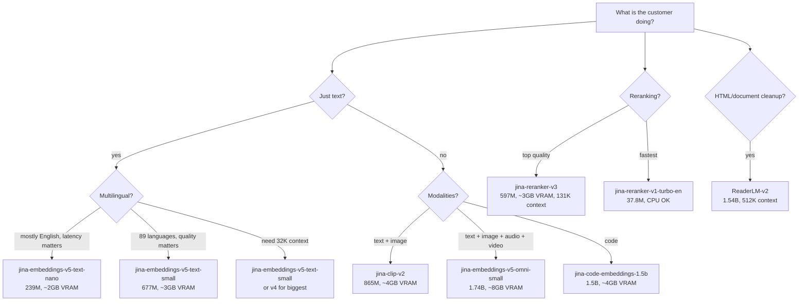
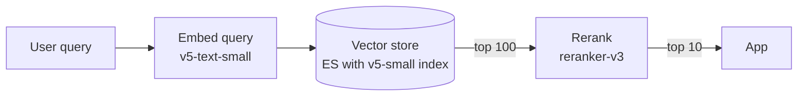

There are 28 models. Most customers need one of six. Use this decision tree.

## Quick reference by use case

| Use case | Model | Why |
|---|---|---|
| First demo / proof of concept | `jina-embeddings-v5-text-nano` | smallest, fastest to bundle, CPU works |
| Production multilingual semantic search | `jina-embeddings-v5-text-small` | 89 languages, task-aware, 32K context |
| Drop-in for OpenAI `text-embedding-3-small` | `jina-embeddings-v5-text-nano` | similar dim (768), credible quality |
| Multimodal RAG (PDFs with images) | `jina-embeddings-v4` or `v5-omni-small` | image + text in same space |
| Image search | `jina-clip-v2` | optimized for text + image |
| Code search | `jina-code-embeddings-1.5b` or `0.5b` | trained on code |
| Reranking | `jina-reranker-v3` | best quality, long context |
| Cheap fast reranking | `jina-reranker-v1-turbo-en` | 38M params, CPU OK |
| HTML to clean markdown | `ReaderLM-v2` | 512K context, document focused |
| Legacy English embeddings | `jina-embeddings-v2-base-en` | Apache-2.0, no commercial license needed |

## Trade-offs

**Bigger isn't always better.** v5-text-small is a stronger model than v5-text-nano, but the nano is 3x smaller and runs on CPU. For a customer with tight latency SLA and English-only data, nano often wins.

**CC-BY-NC-4.0 license matters for sales.** All v5/v4/v3 models are CC-BY-NC-4.0 - the customer needs a commercial license from Elastic. v2 and v1 models are Apache-2.0 and free for any use. If the customer is allergic to vendor lock-in or wants to evaluate without buying, start with `jina-embeddings-v2-base-en` (or `-zh`, `-de`, `-es`).

**Multimodal models cost more memory.** A v5-omni-small needs ~8GB VRAM. A v5-text-nano needs 2GB. If the customer doesn't actually need image/audio/video, don't pay for it.

**Matryoshka truncation lets you downsize at query time.** v5/v4/v3 support requesting any dim from 32 to the model's max (768 / 1024 / 2048). A customer can index at 1024-dim and query at 128-dim if they want a smaller index. Pass `dimensions: 128` in the request.

## When to use multiple models

A real production stack often combines:

- Embedding model for indexing and first-pass retrieval
- Reranker for high-precision top-K
- Optional ReaderLM if input is messy HTML/PDF

Both models can run side-by-side in two containers, OR you can deploy two replicas of each behind a load balancer if QPS demands it. See [Sizing & Hardware](Sizing-And-Hardware) for capacity planning.

## Next

- [Sizing & Hardware](Sizing-And-Hardware) - how much GPU/RAM/disk
- [Model Catalog](Model-Catalog) - full specs for all 28
- [Customer Scenarios](Customer-Scenarios) - applied examples
