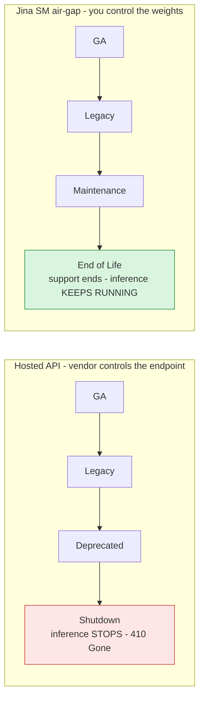
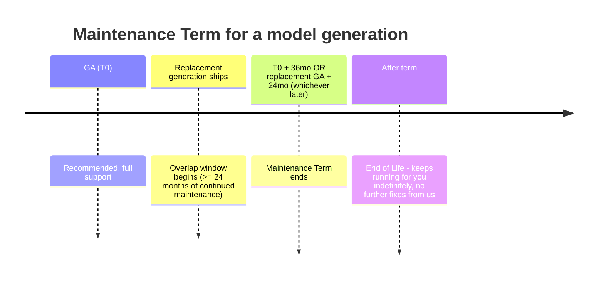

The support, maintenance, and end-of-life (EOL) policy for self-managed (SM) / air-gapped Jina AI models. This page explains, in plain terms, how long a model you deploy will keep working, how long Jina/Elastic maintains it, what "end of life" actually means when the weights live inside your own network, and - importantly - what "maintenance" can and cannot mean for a machine-learning model as opposed to ordinary software. It is the reference for field, support, procurement, security, and audit questions about the lifetime of a Jina SM deployment.

> **Read this first.** Hosted-API providers (OpenAI, Cohere, Azure Foundry, Amazon Bedrock) tie "end of life" to a *shutdown date*: after that date the endpoint is switched off and your requests fail. Air-gapped Jina SM is different by design. You hold the weights inside your own perimeter, so there is **no technical kill switch, no phone-home, and no date on which the software forces itself to stop** - a deployed model does not go dark because a clock ran out on our side. EOL here is about how long *we* keep maintaining and supporting a model, not about a remote switch that disables it.
>
> **Two distinct things - do not conflate them:** (1) *Technical continuity* - the bundle keeps running as long as you run it; nothing we operate can remotely disable it. (2) *Commercial right to use* - Jina SM is sold as a **term-based subscription**, not a perpetual license. Production use requires a **current, in-term commercial entitlement**, and continued use past the term requires **renewal**, exactly like other Elastic SM subscriptions. So the mental model is: **you are not renting *access* from our servers (there is nothing to shut off), but you are subscribing to the *right to use* on a term that must be renewed.** The absence of a technical kill switch is an availability/reliability guarantee, not a grant of perpetual license rights. See [Licensing and the subscription term](#licensing-and-the-subscription-term).

## Contents

- [How SM lifecycle differs from a hosted API](#how-sm-lifecycle-differs-from-a-hosted-api)
- [Models are not software: what "maintenance" really means](#models-are-not-software-what-maintenance-really-means)
- [Lifecycle stages](#lifecycle-stages)
- [Maintenance term (how long we support a model)](#maintenance-term-how-long-we-support-a-model)
- [Support term](#support-term)
- [Notice and communication](#notice-and-communication)
- [Determinism and migration guarantees](#determinism-and-migration-guarantees)
- [Licensing and the subscription term](#licensing-and-the-subscription-term)
- [Current lifecycle status](#current-lifecycle-status)
- [FAQ](#faq)

## How SM lifecycle differs from a hosted API

| | Hosted API (OpenAI / Cohere / Azure) | Jina SM (air-gap) |
|---|---|---|
| What EOL takes away | Access to the model (endpoint shut down) | Only our maintenance + support |
| Does inference stop at EOL? | Yes - requests fail | **No** - your bundle runs indefinitely |
| Who holds the weights | The vendor | **You**, baked into the bundle |
| Forced migration | Yes, by the shutdown date | **Never** - you migrate when it suits you |
| What ends the model's usefulness | The vendor's calendar | Your own quality / risk / compliance decision |

## Models are not software: what "maintenance" really means

This is the most common misunderstanding, and getting it wrong leads to unrealistic expectations. **A model is not a program you can patch line by line.** Its behaviour is baked into a fixed set of trained weights. That has concrete consequences for what maintenance can and cannot deliver.

**What we CAN maintain during a model's supported life:**

- **The runtime and server** (`server/app.py`): API compatibility, new schema support, bug fixes in request handling, batching, and I/O.
- **Dependencies**: patching a CVE in `transformers`, `torch`, or any bundled Python package by pinning to a fixed version and rebundling. See [Versioning & Updates -> Catalog and dependency bumps](Versioning-And-Updates).
- **Packaging**: new base images, CPU/GPU build fixes, quantization variants of the *same* weights (for example an INT8/FP8 build to fit smaller hardware). Quantization is a lossless-to-near-lossless repackaging of the existing weights - it does not retrain them.
- **Documentation, sizing, and deployment guidance.**

**What maintenance CANNOT do - because it is physically not how models work:**

- **We cannot "fix" a model's quality on a specific task by patching it.** If a model underperforms on, say, a particular language or domain, there is no code change that repairs it. The only way to change what a model *knows* or *how well it performs* is to **train new weights** - and new weights are, by definition, **a new model generation**, not a patch to the old one.
- **We do not retrain or alter the weights of a released model.** A shipped generation is frozen. This is a feature, not a limitation: it is exactly what guarantees that the same bundle produces bit-identical output forever (see [determinism](#determinism-and-migration-guarantees)), which is what regulated customers require for reproducibility and audit.
- **A "quality upgrade" is always a migration to a newer generation, never an in-place fix.** When we release, for example, a v5 text embedding model, that is the successor to v3 - a different model with different weights and different output vectors, not a repaired v3.

> **Rule of thumb.** Treat a model version like a pressed vinyl record, not like a web app. We can fix the turntable (runtime), replace a worn needle (dependencies), and press the same recording onto a lighter disc (quantization). We cannot re-record the music without cutting a new record (a new model generation). Anyone expecting a model to be "hotfixed" on a task the way a software bug is patched is applying the wrong mental model - and will mis-plan their roadmap because of it.

This is why the lifecycle below separates **runtime maintenance** (which we do, on a schedule) from **model quality** (which only ever improves by adopting a new generation, on your timeline).

## Lifecycle stages

Every Jina SM model generation is in exactly one stage. The stage describes the **level of maintenance and support we commit to** - never whether the model still runs for you.

| Stage | What it means | New deployments | Your existing deployment runs? | Runtime maintenance (CVE / deps / bug fixes) | Support (Q&A, guidance) |
|---|---|---|---|---|---|
| **GA (General Availability)** | The current recommended generation for its capability. | Recommended | Yes | Yes | Full |
| **Legacy** | A newer generation exists and is recommended, but this one is still fully supported. Migrate at your convenience. | Allowed | Yes | Yes | Full |
| **Maintenance** | Superseded by a newer generation. Still receives security and critical runtime fixes; no new features. Migration recommended. | Discouraged | Yes | Security / critical only | Full |
| **End of Life (EOL)** | We no longer issue fixes or provide standard support. The model **keeps running in your environment** - you own its continued operation, and you can keep running it as long as you like. | Not recommended | Yes (you operate it) | None from us | Best-effort / none |

Note there is deliberately **no "Shutdown" or "Retired" stage**. Those stages only exist for hosted services with a vendor-controlled endpoint. In an air-gap deployment there is nothing for us to retire - the artifact is yours. See [Versioning & Updates -> What a bundle pins](Versioning-And-Updates) and [FAQ -> What if the model upstream gets pulled from HuggingFace?](FAQ).

## Maintenance term (how long we support a model)

The **Maintenance Term** is the window during which Jina/Elastic actively maintains a model generation - runtime security patches, critical bug fixes, dependency updates, and packaging support.

Because these are long-lived, on-premise and often air-gapped deployments in regulated environments - where re-certifying a new model is expensive and slow - we commit to a long horizon. For each Jina SM model generation, the Maintenance Term runs for **at least the longer of:**

- **36 months (3 years)** from the model generation's GA (initial public release) date, **or**
- **24 months (2 years)** from the GA date of its **direct replacement** generation,

whichever is later - and in practice we expect to maintain widely deployed generations for **three to four years or more**. As long as Jina/Elastic offers the air-gap product, we intend to keep maintaining the generations customers actually run in production; we will not strand a deployed customer on a short clock. This is deliberately longer than typical hosted-API windows (OpenAI commits to a 6-month minimum before retirement; Azure Foundry to an 18-month GA lifecycle) because those clocks govern *shutting an endpoint off*, which does not apply here - our clock only governs how long *we* keep shipping fixes.

Remember what "maintenance" covers here: **runtime, dependencies, packaging, and quantization of the same weights - not model quality.** Improved quality only ever arrives as a new generation, which you adopt on your own schedule (see [Models are not software](#models-are-not-software-what-maintenance-really-means)).

### Worked example

- `jina-embeddings-v3` GA: **2024-09-18**
- `jina-embeddings-v5-text-*` (its direct replacement) GA: **2026-02-18**
- Maintenance Term end = later of:
  - 2024-09-18 + 36 months = 2027-09-18
  - 2026-02-18 + 24 months = 2028-02-18  ← later
- So `jina-embeddings-v3` is maintained until at least **2028-02-18** - roughly two full years of overlap with v5 to evaluate, re-certify, and migrate at your own pace. And after that date, any v3 bundle you deployed still runs; it simply stops receiving new fixes from us.

## Support term

Support (your questions, plus deployment / integration / sizing / migration guidance) tracks the parent Elastic support entitlement and applies while a model is in the GA, Legacy, or Maintenance stage. Formal support tiers, SLAs, and schedules are defined in the Jina SM Support Policy (in progress; see [FAQ](FAQ)). For air-gapped and regulated deployments, support is delivered through your approved channel and never requires the model to reach the internet.

## Notice and communication

Because nothing is ever force-retired, our notices are there to help you *plan*, not to warn you of impending loss of access.

| Event | Notice we give | Where |
|---|---|---|
| New GA generation released (predecessor becomes Legacy) | At release | [Model Catalog](Model-Catalog), release notes, `models/catalog.json` |
| A generation enters **Maintenance** | At least **6 months** before the Maintenance Term ends | Release notes, this page, your account/support contact |
| A generation reaches **End of Life** | Announced when the Maintenance Term ends | This page, release notes |
| Security-critical issue that needs your action | As soon as reasonably possible | Support contact, security advisory |

## Determinism and migration guarantees

- **A bundle is immutable.** Same bundle + same input = bit-identical output, forever. Reaching EOL does not change this. See [Versioning & Updates -> Embedding determinism](Versioning-And-Updates). This is a direct consequence of frozen weights (see [Models are not software](#models-are-not-software-what-maintenance-really-means)).
- **Upgrades are always yours to initiate**, using the blue/green pattern in [Versioning & Updates](Versioning-And-Updates). No auto-upgrade, no forced cutover, ever.
- **Reindex planning**: moving to a newer generation changes the embeddings (that is the point of a better model), so plan a reindex window - see [Versioning & Updates -> Reindex strategy](Versioning-And-Updates).
- **Long-term continuity**: the Apache-2.0 toolkit, Dockerfiles, and CLI are public. Even after a generation reaches EOL, you can re-bundle any model you are licensed for directly from its weights, subject to the model license. See [FAQ -> What's the long-term commitment?](FAQ).

## Licensing and the subscription term

**Jina SM is a term-based subscription, not a perpetual license.** The customer buys the right to use the software for a defined term and must **renew to retain that right**, the same way other Elastic self-managed subscriptions work. Nothing on this page changes that.

What the air-gap architecture changes is only the *enforcement mechanism*, not the *commercial obligation*:

| Axis | What it means | Jina SM |
|---|---|---|
| **Commercial right to use** | The contractual license to run the software in production | **Term subscription** - time-bound, must be renewed |
| **Technical continuity** | Whether the software keeps functioning at runtime | No kill switch, no phone-home, no forced-stop date |

These are independent. The absence of a technical kill switch is an availability and reliability guarantee (a deployed bundle will not go dark mid-term because of something on our side); it is **not** a grant of perpetual rights. A customer whose term has lapsed is **out of subscription and must renew to remain licensed**, even though the software would still technically run. Continuing to run a bundle after the term has ended, without renewal, is a license compliance matter, not a technical state we enforce remotely.

For revenue recognition: treat this as a term subscription. The optional built-in [time-bound license key](Licensing) mirrors this - it carries an expiry and can flag an out-of-term deployment - but by default it is fail-open and never blocks a running customer, precisely because entitlement is governed by the contract, not by the software. See [Licensing](Licensing) for how the key works and its capability boundaries.

**Lifecycle stage vs. license are also independent.** Model weights stay under their original license (most current generations are CC-BY-NC-4.0; v1/v2 are Apache-2.0 - see [Model Catalog](Model-Catalog)). A CC-BY-NC-4.0 model in production requires a valid, in-term Elastic commercial subscription at every lifecycle stage. Reaching EOL neither grants new license rights nor extends your subscription term.

## Current lifecycle status

Generation-level status. Individual model IDs and per-model licenses are in the [Model Catalog](Model-Catalog).

| Capability | GA (recommended) | Legacy / Maintenance | Notes |
|---|---|---|---|
| Text embedding | `jina-embeddings-v5-text-small` / `-nano` (GA 2026-02-18) | `jina-embeddings-v3` (Maintenance, term to >= 2028-02-18) | v2 base models (Apache-2.0) remain available for license-free evaluation |
| Multimodal embedding | `jina-embeddings-v5-omni-small` / `-nano` (GA 2026-05-07) | `jina-embeddings-v4` (Legacy; Qwen Research License), `jina-clip-v2` | omni supersedes v4 multimodal |
| Code embedding | `jina-code-embeddings-1.5b` / `0.5b` (GA 2025-09-01) | - | |
| Reranker | `jina-reranker-v3` (GA 2025-10-01) | `jina-reranker-m0` (multimodal), `jina-reranker-v2-base-multilingual` | |
| Reader / HTML-to-Markdown | `ReaderLM-v2` (GA 2025-01-16) | `reader-lm-1.5b` / `-0.5b` | |
| Vision-language (reader / OCR) | `jina-vlm` (GA 2025-12-04) | - | |

> Dates are model GA (initial public release) dates from the official model catalog. This table is generation-level planning guidance; it is not a commitment to retire any model on a specific date, because SM models are not retired.

## FAQ

**If a model is at End of Life, do I have to stop using it?**
EOL only means we stop shipping fixes and standard support for that generation - there is no technical switch that stops it, so a deployed bundle keeps running exactly as before. Note this is separate from your subscription: you still need a current, in-term commercial subscription to be licensed to run it (Jina SM is a term subscription, not a perpetual license - see [Licensing and the subscription term](#licensing-and-the-subscription-term)). Many air-gapped customers deliberately freeze a validated model for years, under an active subscription.

**Can you fix the model's accuracy on our specific documents/language without us migrating?**
No - and this is fundamental, not a policy choice. A model's quality is determined by its trained weights, which are frozen. There is no patch that changes what a model has learned. Better quality on a task comes only from a newer generation (new weights), which you adopt as a migration. What we *can* do within a generation is fix the runtime, patch dependencies, and provide quantized builds of the same weights.

**How long will you really support the model we deploy today?**
At least 3 years from its GA, and at least 2 years after its replacement ships, whichever is later - and in practice we expect three to four years or more for widely deployed generations. As long as we offer this product, we maintain what customers run.

**What happens to support if Jina/Elastic stops offering the product entirely?**
Your bundles still run - they are self-contained and yours. Because the toolkit, Dockerfiles, and CLI are Apache-2.0 and public, you (or a third party) can continue to re-bundle and operate any model you are licensed for from its weights. There is no license server or kill switch that could strand you.

**Is quantization a "change" to the model?**
It is a repackaging of the *same* trained weights into a more compact numeric format, with quality held to a near-lossless bar. It is not retraining and does not alter what the model knows. We treat it as maintenance/packaging, not a new generation.

## Next

- [Versioning & Updates](Versioning-And-Updates) - roll out a new generation with zero downtime
- [Model Catalog](Model-Catalog) - per-model params, context, license
- [FAQ](FAQ) - business/licensing and long-term-commitment questions
- [Why Air-Gap](Why-Airgap) - why deployed models never stop working
