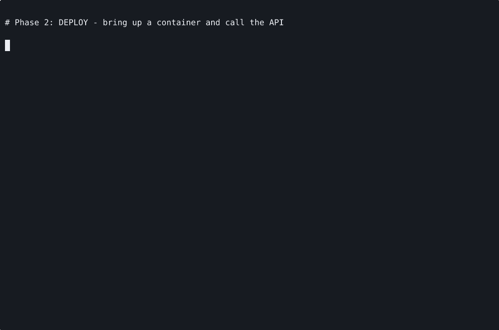
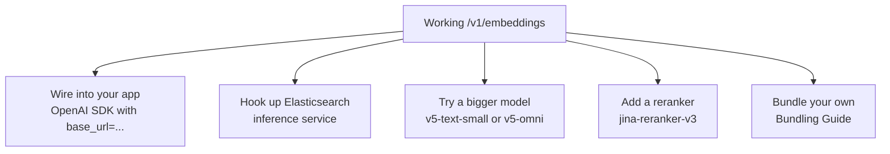

Get your first `/v1/embeddings` response in five minutes.

We'll use a **prebuilt CPU image** of `jina-embeddings-v5-text-nano`. No GPU needed, no Python, no bundle phase. Pure Docker.



## The five-minute path


## Prerequisites

- Docker installed (`docker ps` returns without error)
- ~3GB free disk
- Port 8080 available
- A GitHub personal access token with `read:packages` scope ([create one](https://github.com/settings/tokens/new?scopes=read:packages))

> **Air-gapped target host?** Run steps 1-3 on a connected machine, transfer the `.tar.gz`, resume from step 4 on the offline host.

## 1. Authenticate to GHCR

Prebuilt images live in `ghcr.io/jina-ai/jina-on-prem/*`. They require auth (one-time):

```bash
echo "YOUR_GH_TOKEN" | docker login ghcr.io -u YOUR_GH_USERNAME --password-stdin
```

## 2. Pull the image

```bash
docker pull ghcr.io/jina-ai/jina-on-prem/jina-embeddings-v5-text-nano:cpu
```

~800 MB compressed, 2.9 GB on disk. Takes 1-3 minutes on a typical link.

## 3. (Optional) Export for offline transport

If the target host has no network:

```bash
docker save ghcr.io/jina-ai/jina-on-prem/jina-embeddings-v5-text-nano:cpu \
  | gzip > jina-v5-nano.tar.gz
# Transfer jina-v5-nano.tar.gz to the air-gapped host (SCP, USB, ...), then on the host:
docker load < jina-v5-nano.tar.gz
```

The repo ships [`scripts/pull-prebuilt.sh`](https://github.com/jina-ai/jina-on-prem/blob/main/scripts/pull-prebuilt.sh) which does steps 1-3 in one command:

```bash
./scripts/pull-prebuilt.sh jina-embeddings-v5-text-nano cpu
```

## 4. Run

```bash
docker run -d --name jina-nano -p 8080:8080 \
  ghcr.io/jina-ai/jina-on-prem/jina-embeddings-v5-text-nano:cpu
docker logs -f jina-nano   # watch for "Uvicorn running on http://0.0.0.0:8080"
```

For GPU: add `--gpus all` and use the `:gpu` tag.

## 5. Verify

```bash
curl http://localhost:8080/health
```
```json
{"status":"ok","model":"jinaai/jina-embeddings-v5-text-nano","device":"cpu","ready":true,"multimodal":false,"schemas":["openai","voyage","gemini","cohere"]}
```

First embedding:

```bash
curl -s http://localhost:8080/v1/embeddings \
  -H 'Content-Type: application/json' \
  -d '{"input":["Hello world"]}' \
  | jq '.data[0].embedding | length'
# 768
```

If both calls succeed, you're live. The same container also speaks Cohere, Gemini, and Voyage protocols - see [API Reference](API-Reference) for examples.

## What you can do now



- [Customer Scenarios](Customer-Scenarios) - end-to-end deployment patterns
- [API Reference](API-Reference) - all four schemas, multimodal, ES integration
- [Picking a Model](Picking-A-Model) - decision tree for the other 27 models
- [Bundling Guide](Bundling-Guide) - build your own bundle for models not in the prebuilt list

## When things go wrong

The three errors that catch most first-time users:

- `permission denied while trying to connect to the docker API` -> you're not in the `docker` group. [Fix](Troubleshooting#docker-permission-denied).
- `Error response from daemon: error from registry: unauthorized` -> not logged into GHCR. Run step 1.
- `bind: address already in use` -> something's on port 8080. Map a different port: `-p 9090:8080`.

Full list: [Troubleshooting](Troubleshooting).
