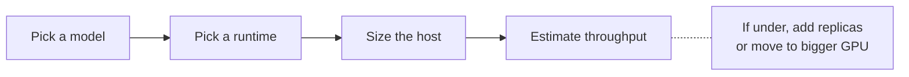
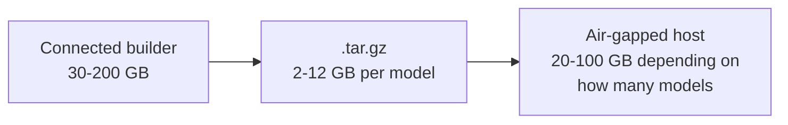
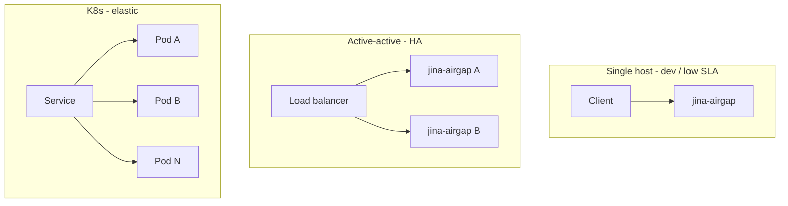

# Sizing & Hardware

Capacity planning for jina-airgap deployments. Covers GPU vs CPU choice, VRAM by model, expected throughput, disk, and redundancy.

## The three knobs



## Runtime: GPU or CPU?

| | CPU image (`:cpu` tag) | GPU image (`:gpu` tag) |
|---|---|---|
| Base | `python:3.11-slim` | `pytorch/pytorch:2.5.1-cuda12.1-cudnn9-devel` |
| Image size | 2-4 GB | 8-12 GB |
| Needs GPU on host | no | yes (CUDA 12.1+, driver 525+) |
| Latency, single request | 200-2000 ms | 10-200 ms |
| Throughput, batched | ~5-20 docs/s | 100-1000 docs/s |
| Cost on GCP (1 month, on-demand) | ~$50 (e2-standard-4) | ~$500 (g2-standard-4 + L4) |

**Rule of thumb**: < 10 QPS sustained -> CPU is fine and a lot cheaper. > 10 QPS or latency-sensitive interactive use -> GPU.

## Per-model VRAM and recommended GPU

| Model | Min VRAM | Recommended GPU | Notes |
|---|---|---|---|
| jina-embeddings-v5-text-nano | 2 GB | T4 / L4 | CPU also fine |
| jina-embeddings-v5-text-small | 3 GB | L4 / A10G | T4 OK with smaller batches |
| jina-embeddings-v5-omni-small | 8 GB | L4 / A10G / A100 | multimodal |
| jina-embeddings-v4 | 10 GB | A10G / A100 | multimodal, 32K |
| jina-reranker-v3 | 3 GB | L4 | 131K context |
| jina-clip-v2 | 4 GB | L4 | text + image |
| jina-code-embeddings-1.5b | 4 GB | L4 | |
| ReaderLM-v2 | 4 GB | L4 | 512K context, plan for bigger batches |

Full per-model VRAM in the [Model Catalog](Model-Catalog).

> **L4 is the workhorse**. 24GB, sane price, available in most regions, handles any model except v4-multimodal. Default to it unless the customer needs A100 latency or has L4 stockout (see [Troubleshooting -> L4 stockout](Troubleshooting#l4-stockout)).

## Disk planning



- **Builder machine**: 100 GB minimum if bundling 1-2 models. 200 GB+ if bundling all 6 priority models. Each build holds: built image (2-12 GB) + tar.gz (1-7 GB) + Docker BuildKit cache (up to 20 GB).
- **Air-gapped host**: needs ~2x the image size at runtime (image + Docker layer cache). For a 4 GB image, plan 10 GB disk.
- **Reclaim**: `docker builder prune -af` between bundles. `docker system prune -f` after.

## Throughput math

Rough throughput on a single L4, batch size 32:

| Model | Tokens/s | Documents/s (avg 50 tokens) |
|---|---|---|
| v5-text-nano | ~30,000 | ~600 |
| v5-text-small | ~12,000 | ~240 |
| v5-omni-small (text only) | ~6,000 | ~120 |
| reranker-v3 | ~150 doc-query pairs/s | |

(Measure on the customer hardware. These are starting estimates from `scripts/benchmark.py`.)

For higher throughput:
1. **Batch at the client.** Send 32-256 inputs per request, not one at a time.
2. **Use matryoshka** to truncate output dims at query time if the index dim doesn't need to be full size.
3. **Multiple replicas.** A 4-vCPU + 1xL4 host can run one container. Two hosts -> 2x. Load balance with anything (nginx, HAProxy, ALB).
4. **Bigger GPU.** A10G is ~2x L4, A100 ~4x for these models.

## Redundancy

Three patterns:



- **Single host** is fine for POC, dev, internal tools. No redundancy.
- **Active-active** with two hosts behind any L4 load balancer. Models are stateless so any request can go to any replica. Use this for production. Maintain spare image tarballs on disk so you can rebuild a host without rebundling.
- **Kubernetes** if the customer is already running it. Each pod is `docker run` with a `Service` and `Deployment`. Persistent volume not needed (model is in the image). NodeSelector for GPU nodes if you mix GPU and CPU.

K8s example (one pod, GPU):

```yaml
apiVersion: apps/v1
kind: Deployment
metadata:
  name: jina-embed
spec:
  replicas: 2
  selector: {matchLabels: {app: jina-embed}}
  template:
    metadata: {labels: {app: jina-embed}}
    spec:
      containers:
      - name: jina-embed
        image: jina/jina-embeddings-v5-text-small:gpu
        ports: [{containerPort: 8080}]
        resources:
          limits:
            nvidia.com/gpu: 1
            memory: 8Gi
        readinessProbe:
          httpGet: {path: /health, port: 8080}
          initialDelaySeconds: 30
---
apiVersion: v1
kind: Service
metadata:
  name: jina-embed
spec:
  selector: {app: jina-embed}
  ports: [{port: 8080, targetPort: 8080}]
```

## Customer-side prerequisites checklist

Before you go on-site or hand over a bundle:

- [ ] Host with Docker 24+ installed
- [ ] (GPU) NVIDIA driver >= 525, CUDA Container Toolkit installed (`nvidia-smi` works in container)
- [ ] Disk: 2-3x the bundle size free
- [ ] Port 8080 (or chosen port) free
- [ ] Network plan: how does the calling app reach this host? localhost / LAN IP / internal DNS?
- [ ] (Optional) Load balancer in front if multi-replica

If the customer has none of this set up, `scripts/bootstrap-gcp.sh` is a template - copy it and adapt for their cloud or on-prem.

## Next

- [Bundling Guide](Bundling-Guide) - how to actually build the .tar.gz
- [Quick Start](Quick-Start) - first-deploy walkthrough
- [Troubleshooting](Troubleshooting) - VRAM OOM, CUDA mismatch, etc
