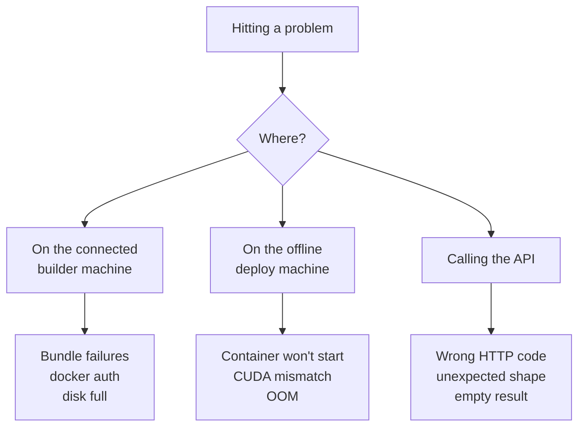

If you hit something not listed here, please [open an issue](https://github.com/jina-ai/jina-airgap/issues/new) with the full error and `docker logs <container>` output.



Jump to a section: [Docker / install](#docker-permission-denied) - [L4 stockout](#l4-stockout) - [CUDA mismatch](#cuda-mismatch) - [OOM](#out-of-memory-on-gpu) - [Transformers version pins](#transformers-version-pins) - [GHCR auth](#prebuilt-pull-unauthorized) - [Wrong endpoint](#wrong-endpoint-returns-500) - [Network=none](#dont-use---networknone-for-air-gap-testing) - [Disk full](#disk-full-during-multi-model-build) - [Flash-attn build](#bundle-build-fails-on-flash-attn-compile) - [Spot preemption](#spot-instance-preempted-mid-build) - [Pushed image not visible](#oci-labels-missing-on-pushed-images) - [Reranker NaN](#empty--nan-embeddings-on-qwen3-reranker)

## Docker permission denied

**Symptom**

```
permission denied while trying to connect to the docker API at unix:///var/run/docker.sock
```

or from the CLI:

```
Error: Docker is not installed or not running.
```

**Cause**: your user isn't in the `docker` group, or the group membership hasn't been applied to your current shell session.

**Fix**:

```bash
sudo usermod -aG docker $USER
# then either reconnect SSH / open a new terminal, OR:
sg docker -c 'docker ps'        # apply group in current session
# OR prefix one-off commands with sudo:
sudo docker ps
```

## L4 stockout

**Symptom** (from `gcloud compute instances create`):

```
The zone 'projects/PROJECT/zones/ZONE' does not have enough resources to fulfill the request.
'NULL:0/NULL:0/NULL:0 (state:STOCKOUT, sub-state:STOCKOUT, resource type:compute)'
```

**Cause**: L4 GPUs are heavily oversubscribed. As of May 2026, all `us-central1-*`, `us-west1-*`, `us-east1-*`, `us-east4-*` were simultaneously out.

**Fix**: try zones in this order, picking the first that succeeds:

1. `us-west1-a`, `us-east4-a` (cheapest egress to most clients)
2. `europe-west4-a`, `europe-west1-b`
3. `asia-southeast1-a` (Singapore - usually available)
4. As a last resort, switch to A100 or T4 in a US zone with quota.

A retry loop is at the bottom of [`scripts/bootstrap-gcp.sh`](https://github.com/jina-ai/jina-airgap/blob/main/scripts/bootstrap-gcp.sh).

## Prebuilt pull unauthorized

**Symptom**:

```
Error response from daemon: error from registry: unauthorized
```

**Cause**: GHCR images live under `ghcr.io/jina-ai/jina-airgap/*` and require a logged-in user.

**Fix**: docker login with a GitHub PAT that has `read:packages` scope:

```bash
echo "ghp_..." | docker login ghcr.io -u YOUR_GH_USERNAME --password-stdin
```

If using `sudo docker pull`, run `sudo docker login` first (root and user have separate credentials).

## CUDA mismatch

**Symptom**: GPU container exits immediately with `CUDA error: no kernel image is available for execution on the device` or `forward compatibility was attempted on non supported HW`.

**Cause**: host's NVIDIA driver is older than what the image was compiled against. GPU image targets CUDA 12.1; you need driver `>=525.60`.

**Fix**:

```bash
nvidia-smi   # check the Driver Version line, NOT the CUDA version line
```

If `<525`, either update the driver or use the CPU image (`:cpu` tag) which has no CUDA dependency.

## Out of memory on GPU

**Symptom**: `CUDA out of memory. Tried to allocate XX MiB`.

**Cause**: model is too big for the GPU's VRAM, or another container is already using it.

**Fix**: check VRAM with `nvidia-smi`. The [Model Catalog](Model-Catalog) lists per-model VRAM. If you have 24 GB and the model says ~8 GB, you should fit two replicas but not four. Reduce batch size at the client (smaller `input` arrays) or pick a smaller model. See [Sizing & Hardware](Sizing-And-Hardware).

## Transformers version pins

**Symptom**: `ImportError: cannot import name 'Qwen3Config' from 'transformers'` or similar `cannot import` errors, only when running `serve` directly (not via Docker).

**Cause**: model needs a specific transformers version. Each model's `deps` block in `models/catalog.json` pins it; the Docker image installs exactly that. If you `serve` outside Docker you must mirror the pins.

| Model family | transformers | Why |
|---|---|---|
| v5-text-nano, v5-text-small | `==4.51.0` | needs `Qwen3Config` (added in 4.51) |
| v5-omni-nano, v5-omni-small | `==4.57.0` | needs `Qwen3VLVisionConfig` (added in 4.57) |
| v3 | `==4.48.3` | older base, no qwen3 dependency |
| reranker-v3 | `==4.51.0` | based on Qwen3 |

> The bundle phase deletes each model repo's own `requirements.txt` after download. This prevents runtime auto-upgrade by `trust_remote_code` paths that would otherwise call `pip install -r requirements.txt`.

## Wrong endpoint returns 500

**Symptom**: calling `/v1/embeddings` on a reranker container returns HTTP 500 (or vice versa).

**Cause**: reranker models can't serve embedding requests. They expose `/v1/rerank` only. The server doesn't currently return a helpful 400 for this case.

**Fix**: route the request to the right container. Embedding clients hit the embedding container; reranking clients hit the reranker container.

## Empty / NaN embeddings on Qwen3 reranker

**Symptom**: reranker scores are all 0.5 or all NaN.

**Cause**: Qwen3-based rerankers need `pad_token = eos_token`. The server sets this automatically. If you're loading the model with the SentenceTransformers SDK directly:

```python
model = CrossEncoder(...)  # NOT SentenceTransformer
model.tokenizer.pad_token = model.tokenizer.eos_token
```

## Don't use `--network=none` for "air-gap testing"

**Symptom**: testing with `docker run --network=none ...` and the host can't reach `localhost:8080`.

**Cause**: `--network=none` removes the container's network namespace entirely. The `-p 8080:8080` port mapping silently does nothing because there's no container IP to forward to.

> Older CLI versions printed a "Air-gap verification" hint that used `--network=none`. Don't follow it - the suggestion has been removed in current builds.

**The real air-gap guarantee** is that `HF_HUB_OFFLINE=1` and `TRANSFORMERS_OFFLINE=1` are baked into the image, so any code path that would download a weight fails immediately. Run normally with `-p 8080:8080` and trust the env vars.

To prove it's offline: run on a host with no egress route, watch `docker logs <container>`. Nothing should be trying to fetch anything.

## Bundle build fails on `flash-attn` compile

**Symptom**: GPU bundle build hangs or OOMs during `pip install flash-attn`.

**Cause**: `flash-attn` requires `nvcc` (CUDA compiler), which isn't in the runtime-only base image. The Dockerfile uses the `-devel` variant of pytorch/pytorch which includes nvcc - if you've forked, make sure you're still on `pytorch/pytorch:2.5.1-cuda12.1-cudnn9-devel`.

## Spot instance preempted mid-build

**Symptom**: SSH disconnects, `gcloud compute instances list` shows TERMINATED.

**Cause**: GCP spot/preemptible instances can be reclaimed any time.

**Fix**: start bundles with `nohup` so disconnection doesn't kill the build:

```bash
nohup bash -c 'cd ~/jina-airgap && python3 jina-airgap.py bundle --model X --yes' > ~/bundle.log 2>&1 &
disown
```

Reconnect later: `tail -f ~/bundle.log`. Docker images persist across restart; `/tmp` does not.

## Disk full during multi-model build

**Symptom**: `no space left on device` after building two or three bundles.

**Cause**: each bundle leaves the BuildKit cache, the built image, and the `.tar.gz` - ~10-20 GB cumulative per model.

**Fix**:

```bash
docker builder prune -af       # reclaim BuildKit cache (safe)
docker image prune -f          # dangling intermediate images
rm jina-OLDMODEL-*.tar.gz      # tarballs already transferred
docker system df               # see what's left
```

## OCI labels missing on pushed images

**Symptom**: image pushed to GHCR but doesn't appear in the repo's package list.

**Cause**: the `LABEL org.opencontainers.image.source=https://github.com/jina-ai/jina-airgap` is missing from the Dockerfile.

**Fix**: both `docker/Dockerfile.cpu` and `docker/Dockerfile.gpu` include this label. If you've forked, keep it. After fixing, retag and push - GitHub picks up the link on next push.

## Got something else?

Please [file an issue](https://github.com/jina-ai/jina-airgap/issues/new) with:

- `docker --version` and `nvidia-smi` if GPU
- The full command you ran
- `docker logs <container>` if a container started but failed
- Last 50 lines of bundle log if a build failed

The [CONTRIBUTING.md](https://github.com/jina-ai/jina-airgap/blob/main/CONTRIBUTING.md) has more debug history from the maintainers' perspective.
