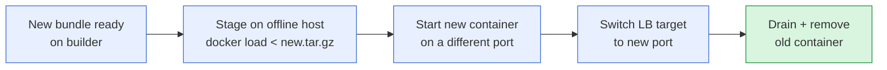
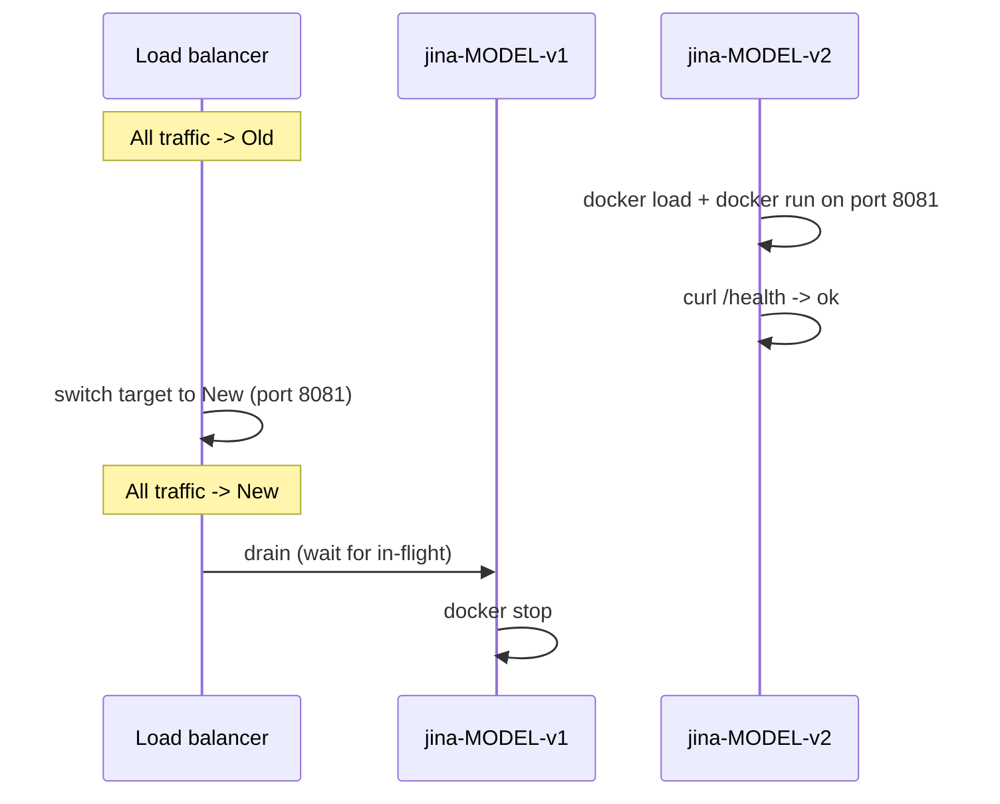

How to handle model upgrades, dependency bumps, and customer-side rollouts without downtime. Common SA question once the first deployment is live.



## What a bundle pins

A jina-airgap bundle freezes everything that influences inference output:

- **Model weights** at the exact HF commit at bundle time
- **Tokenizer + processor** files
- **Python dependencies** at the versions declared in `models/catalog.json` `deps`
- **Server code** (`server/app.py`) at the commit you built from
- **Base image** (python:3.11-slim for CPU, pytorch/pytorch:2.5.1-cuda12.1-cudnn9-devel for GPU)

This means: **same bundle = byte-identical embeddings forever**. You can verify by hashing the response on two replicas after a host rebuild.

## When to rebundle

| Trigger | What changes | Action |
|---|---|---|
| Upstream model release (e.g. v5.1) | `hf_repo` weights | Rebundle, redeploy |
| Server bug fix | `server/app.py` | Rebundle (no model change), redeploy |
| Security CVE in a Python dep | `deps` versions | Pin to patched version in `catalog.json`, rebundle |
| Bigger context or new task type | `server/app.py` | Rebundle |
| New API schema added | `server/app.py` | Rebundle |
| Customer wants to test a different model | new bundle for new model | New bundle, deploy alongside |

## Zero-downtime rollout

The pattern is **blue/green** at the load balancer (or DNS, or kube service selector):



Concrete steps for a single host with two containers:

```bash
# old: jina-MODEL-v1, on port 8080, container name jina-blue
# new: jina-MODEL-v2 (just loaded), spin up on port 8081 / jina-green
docker load < jina-MODEL-v2-cpu.tar.gz
docker run -d --name jina-green -p 8081:8080 jina/jina-MODEL-v2:cpu
sleep 60   # wait for /health
curl http://localhost:8081/health
# Repoint upstream / load balancer to 8081 (or swap the published port via nginx)
# Drain old:
docker stop jina-blue
docker rm jina-blue
```

For Kubernetes, use a normal `Deployment` rollout (`kubectl set image deployment/jina-embed jina-embed=jina/MODEL:v2`). Default rolling update handles this.

## Embedding determinism across versions

**Same bundle, same input -> bit-identical output.**

**Different bundle versions: not guaranteed.** Even minor transformers bumps can change rounding behavior. Before swapping the bundle in production:

1. Hash the embedding output on a representative sample (say 1000 docs).
2. Compute cosine similarity between old and new bundle outputs.
3. If similarity drops noticeably (e.g. < 0.99 average), re-index, don't just hot-swap. Otherwise downstream similarity scores will shift.

For most upstream model updates, embeddings *change* (that's the point). Plan a reindex window unless you've verified compatibility.

## Reindex strategy

Two patterns:

**Pattern A: full reindex window (simplest)**

1. Stand up the new model in parallel
2. Reindex the corpus through the new model
3. Cut over the search frontend to the new index
4. Drop old container + old index

Downtime: zero for inference, but search may degrade or be unavailable briefly during cutover unless you dual-index.

**Pattern B: dual-write (no downtime, more disk)**

1. Add the new model as a second inference endpoint
2. Update the indexing pipeline to write to *both* indexes
3. Backfill the new index for old docs
4. Cut search reads over to the new index
5. Stop dual-write, drop old index

Doubles disk usage during the transition. Use when you can't afford even brief read-side disruption.

## Catalog and dependency bumps

If you're maintaining a fork or pinning custom deps:

- `models/catalog.json` is the single source of truth for per-model versions.
- After editing a `deps` block, regenerate the Model Catalog page: `python3 scripts/gen_catalog_md.py > docs/Model-Catalog.md && ./scripts/sync-wiki.sh`.
- `CONTRIBUTING.md` documents why each pin exists (transformers 4.51 for Qwen3Config, etc.). Loosen with care - many models ship requirements.txt that the bundle phase deletes specifically to prevent runtime auto-upgrade.

## Pinning vs floating - guidance

**Pin exact versions** for:
- transformers, torch, sentence-transformers (these affect output)
- Any package the model's custom code imports
- flash-attn (build environment matters)

**Float to >= ranges** for:
- huggingface_hub (rarely affects model behavior at runtime)
- accelerate, einops (utility libs, low risk)

When in doubt, pin. Easier to relax later than to debug a regression in customer prod.

## Rolling back

If a new bundle misbehaves:

```bash
docker stop jina-green
docker start jina-blue   # if you kept it, or:
docker load < jina-MODEL-v1-cpu.tar.gz && docker run -d --name jina-blue -p 8080:8080 ...
```

Keep the previous bundle's `.tar.gz` on disk (or in your artifact store) for at least one release cycle. Rollback is just another `docker load`.

## Customer-side change control

Most regulated customers need to track:

| Item | Where to find it |
|---|---|
| Bundle SHA | `sha256sum jina-MODEL-cpu.tar.gz` |
| Image digest | `docker inspect --format='{{.Id}}' jina/MODEL:cpu` |
| Source commit | `LABEL org.opencontainers.image.source` in Dockerfile -> repo + tag |
| Build date | `LABEL` could include build date if you set it |
| Dependency lockfile | `models/catalog.json` `deps` block per model |

Have these ready before submitting a change-management ticket. Customer security teams often want to attest that a specific bundle came from a known source.

## Next

- [Product & Model Lifecycle (EOL)](Product-And-Model-Lifecycle) - how long a generation is maintained, and why a model is not patched like software
- [Sizing & Hardware](Sizing-And-Hardware) - capacity planning for the new version
- [Architecture](Architecture) - what's in the image
- [Troubleshooting](Troubleshooting) - regressions to watch for
