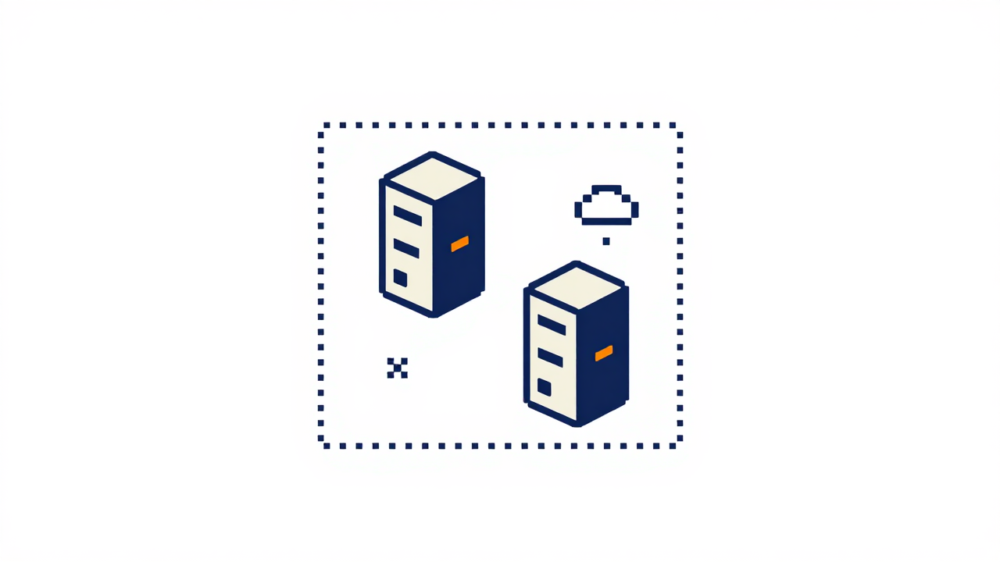

Some customers cannot - or will not - send data to a third-party API. They want the latest AI capabilities on their own infrastructure, with zero outbound network calls. That is the audience jina-airgap is built for.

## Who needs this

| Industry | Why air-gap | Typical setup |
|---|---|---|
| **Banking / Finance** | Customer data, trading signals, internal research cannot leave the network. Regulatory perimeter is hard. | Private VPC, on-prem ES cluster, locked-down inference |
| **Government / Defense** | Classified or controlled-unclassified data. Approved-vendor lists, no SaaS. | SCIF / IL5 environments, no inbound or outbound internet |
| **Healthcare** | HIPAA, GDPR, patient records that legally cannot transit a third-party API. | Hospital data center, on-prem ES, sometimes air-gapped clinical research VLANs |
| **Industrial / OT** | Plant networks isolated from corporate IT. Mission-critical with no tolerance for upstream outages. | Operational tech network, edge inference next to sensors |
| **Sovereign / Localized AI** | Data residency law (EU AI Act, China CSL, India DPDPA). The model must run in-country, often in-customer-DC. | National cloud, customer DC, government-approved region |

If your customer says any of these, jina-airgap is in scope:

- "Our procurement won't approve a SaaS endpoint."
- "We can't send `<sensitive>` to a vendor API."
- "The host has no outbound internet."
- "We need this to keep working if the upstream goes down."
- "Audit needs to see the model artifacts on our disks."

## How it compares

```
  HOSTED API  (api.openai.com / api.cohere.com / api.jina.ai)
  ─────────────────────────────────────────────────────────────
    customer app  ──►  vendor API   every request crosses the
                  ◄──                customer perimeter
                                     vendor handles logs/retention

  jina-airgap  (inside customer environment)
  ─────────────────────────────────────────────────────────────
    customer app  ──►  jina-airgap   localhost / internal DNS
                                     ╳ no outbound calls
                                     ╳ no vendor visibility
```

| | Hosted API (SaaS) | Customer-managed VPC endpoint | jina-airgap |
|---|---|---|---|
| Data leaves customer network | yes | no, but vendor still operates the endpoint | no |
| Works without internet | no | partial (depends on auth/control plane) | yes |
| Customer holds model weights | no | no | yes |
| Per-request cost | yes | reserved capacity | hardware only |
| Latency | network RTT to vendor | network RTT inside VPC | localhost / LAN |
| Audit story | vendor compliance docs | vendor compliance docs | customer owns the artifacts |
| Time to first request | minutes | hours | minutes once the image is on disk |

The price for full air-gap is that the customer has to manage the host (a GPU box or a CPU machine). For most enterprises this is already true for the rest of their stack.

## What "air-gap" means in this project

A jina-airgap container does **not** call out to:

- HuggingFace Hub (`HF_HUB_OFFLINE=1` baked in)
- Any model registry (`TRANSFORMERS_OFFLINE=1` baked in)
- A license server (there isn't one)
- Telemetry or logging endpoints (none exist)

All weights, tokenizers, processors, and Python dependencies are baked into the Docker image at bundle time. After the image is loaded onto the offline machine, the only "network" it speaks is the HTTP API on port 8080.

### Where data goes - request lifecycle

```mermaid
sequenceDiagram
    autonumber
    participant App as Customer app
    participant LB as Optional LB
    participant Cont as jina-airgap container
    participant GPU as GPU/CPU
    participant Disk as Local disk
    participant Net as Internet

    App->>LB: POST /v1/embeddings {input}
    LB->>Cont: forward
    Cont->>Disk: read weights (already cached)
    Cont->>GPU: encode tokens -> tensors
    GPU-->>Cont: embeddings
    Cont-->>LB: 200 OK {embeddings}
    LB-->>App: 200 OK
    Note over Cont,Net: No call to Internet at any step.
HF_HUB_OFFLINE=1 + TRANSFORMERS_OFFLINE=1
make download attempts fail-fast.
```

The request never crosses the customer perimeter. The container has no code path that could make an outbound call - the offline env vars cause `huggingface_hub` and `transformers` to refuse downloads at the function-call layer, not at the network layer. Even if the container had egress, nothing in the request path would try to use it.

> **Common misunderstanding**: `docker run --network=none` is **not** how you verify the air-gap. That mode disables host-to-container reachability so `curl http://localhost:8080` from the host returns nothing - useless. The guarantee is in the env vars and image contents, not the network mode. See [Troubleshooting -> Don't use --network=none](Troubleshooting#dont-use---networknone-for-air-gap-testing).

## Next

- [Quick Start](Quick-Start.md) - get the first response back in 5 minutes
- [Customer Scenarios](Customer-Scenarios.md) - concrete playbooks per industry
- [Sizing & Hardware](Sizing-And-Hardware.md) - GPU/CPU sizing for your customer's volume
